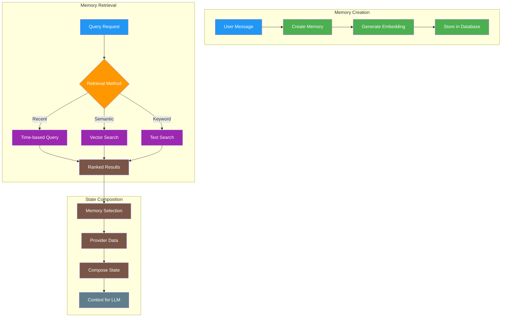

# Memory and State

> Understanding agent memory, context, and state management in elizaOS

## Memory Architecture Overview

In elizaOS, memory and state management are core responsibilities of the `AgentRuntime`. The system provides a unified API for creating, storing, retrieving, and searching memories, enabling agents to maintain context and learn from interactions. For runtime details, see [Runtime and Lifecycle](/agents/runtime-and-lifecycle) and [Runtime Core](/runtime/core).



## Core Memory Concepts

### Memory Interface

Every piece of information an agent processes becomes a Memory:

```typescript theme={null}
interface Memory {
  id?: UUID; // Unique identifier
  entityId: UUID; // Who created this memory (user/agent)
  roomId: UUID; // Conversation context
  worldId?: UUID; // Broader context (e.g., server)
  content: Content; // The actual content
  embedding?: number[]; // Vector representation
  createdAt?: number; // Timestamp
  metadata?: MemoryMetadata; // Additional data
}

interface Content {
  text?: string; // Text content
  actions?: string[]; // Associated actions
  inReplyTo?: UUID; // Reference to previous memory
  metadata?: any; // Custom metadata
}
```

### Memory Lifecycle

#### 1. Creation

```typescript theme={null}
// Creating a memory through the runtime
async function createMemory(runtime: IAgentRuntime, message: string) {
  const memory: CreateMemory = {
    agentId: runtime.agentId,
    entityId: userId,
    roomId: currentRoom,
    content: {
      text: message,
      metadata: {
        source: "chat",
        processed: Date.now(),
      },
    },
  };

  // Runtime automatically generates embeddings if not provided
  const memoryId = await runtime.createMemory(memory);
  return memoryId;
}
```

#### 2. Storage

Memories are persisted through the `IDatabaseAdapter`:

```typescript theme={null}
// The runtime handles storage automatically
// Memories are stored with:
// - Full text for retrieval
// - Embeddings for semantic search
// - Metadata for filtering
// - Relationships for context
```

#### 3. Retrieval

```typescript theme={null}
// Recent memories from a conversation
const recentMemories = await runtime.getMemories({
  roomId: roomId,
  count: 10,
  unique: true, // Deduplicate similar memories
});

// Memories from a specific user
const userMemories = await runtime.getMemories({
  entityId: userId,
  count: 20,
});

// Time-bounded memories
const todaysMemories = await runtime.getMemories({
  roomId: roomId,
  start: startOfDay,
  end: endOfDay,
});
```

## Context Management

### Context Window

The context window determines how much information the agent considers:

```typescript theme={null}
// Context window configuration
export class AgentRuntime {
  readonly #conversationLength = 32; // Default messages to consider

  // Dynamically adjust based on token limits
  async buildContext(roomId: UUID): Promise<State> {
    const memories = await this.getMemories({
      roomId,
      count: this.#conversationLength,
    });

    // Token counting and pruning
    let tokenCount = 0;
    const maxTokens = 4000; // Leave room for response
    const prunedMemories = [];

    for (const memory of memories) {
      const tokens = estimateTokens(memory.content.text);
      if (tokenCount + tokens > maxTokens) break;
      tokenCount += tokens;
      prunedMemories.push(memory);
    }

    return this.composeState(prunedMemories);
  }
}
```

### Context Selection Strategies

#### Recency-Based

Most recent messages are most relevant:

```typescript theme={null}
const recentContext = await runtime.getMemories({
  roomId: roomId,
  count: 20,
  orderBy: "createdAt",
  direction: "DESC",
});
```

#### Importance-Based

Prioritize important memories:

```typescript theme={null}
// Importance scoring based on:
// - User reactions
// - Agent actions taken
// - Explicit markers
const importantMemories = await runtime.searchMemories({
  roomId: roomId,
  filter: {
    importance: { $gte: 0.8 },
  },
  count: 10,
});
```

#### Hybrid Approach

Combine recent and important:

```typescript theme={null}
async function getHybridContext(runtime: IAgentRuntime, roomId: UUID) {
  // Get recent messages for immediate context
  const recent = await runtime.getMemories({
    roomId,
    count: 10,
  });

  // Get important historical context
  const important = await runtime.searchMemories({
    roomId,
    query: "important decisions, key information, user preferences",
    match_threshold: 0.7,
    count: 5,
  });

  // Combine and deduplicate
  const combined = [...recent, ...important];
  return deduplicateMemories(combined);
}
```

### State Composition

State composition brings together memories and provider data:

```typescript theme={null}
// The runtime's state composition pipeline
interface State {
  messages: Memory[]; // Conversation history
  facts: string[]; // Known facts
  providers: ProviderData[]; // Provider contributions
  context: string; // Formatted context
}

// Provider contribution to state
export const userContextProvider: Provider = {
  name: "userContext",
  get: async (runtime, message, state) => {
    const userProfile = await runtime.getEntity(message.entityId);
    return {
      text: `User: ${userProfile.name}`,
      data: {
        preferences: userProfile.metadata?.preferences,
        history: userProfile.metadata?.interactionCount,
      },
    };
  },
};
```

## Memory Types

### Short-term Memory

Working memory for immediate tasks:

```typescript theme={null}
// Short-term memory is typically the current conversation
class WorkingMemory {
  private buffer: Memory[] = [];
  private maxSize = 50;

  add(memory: Memory) {
    this.buffer.push(memory);
    if (this.buffer.length > this.maxSize) {
      this.buffer.shift(); // Remove oldest
    }
  }

  getRecent(count: number): Memory[] {
    return this.buffer.slice(-count);
  }

  clear() {
    this.buffer = [];
  }
}
```

### Long-term Memory

Persistent storage of important information:

```typescript theme={null}
// Long-term memories are marked and preserved
interface LongTermMemory extends Memory {
  metadata: {
    type: "long_term";
    importance: number;
    lastAccessed: number;
    accessCount: number;
  };
}

// Consolidation process
async function consolidateToLongTerm(
  runtime: IAgentRuntime,
  memory: Memory
): Promise<void> {
  if (shouldConsolidate(memory)) {
    await runtime.updateMemory({
      ...memory,
      metadata: {
        ...memory.metadata,
        type: "long_term",
        importance: calculateImportance(memory),
        consolidatedAt: Date.now(),
      },
    });
  }
}
```

### Knowledge Memory

Static and dynamic knowledge:

```typescript theme={null}
// Knowledge loaded from character configuration
const staticKnowledge = character.knowledge || [];

// Dynamic knowledge learned during interactions
async function learnFact(runtime: IAgentRuntime, fact: string) {
  await runtime.createMemory({
    content: {
      text: fact,
      metadata: {
        type: "knowledge",
        learned: true,
        confidence: 0.9,
      },
    },
    roomId: "knowledge-base",
    entityId: runtime.agentId,
  });
}

// Retrieving knowledge
async function getKnowledge(runtime: IAgentRuntime, topic: string) {
  return await runtime.searchMemories({
    query: topic,
    filter: {
      "metadata.type": "knowledge",
    },
    match_threshold: 0.7,
  });
}
```

## Memory Operations

### Creating Memories

Best practices for memory creation:

```typescript theme={null}
// Complete memory creation with all metadata
async function createRichMemory(
  runtime: IAgentRuntime,
  content: string,
  context: any
): Promise<UUID> {
  const memory: CreateMemory = {
    agentId: runtime.agentId,
    entityId: context.userId,
    roomId: context.roomId,
    content: {
      text: content,
      actions: context.actions || [],
      inReplyTo: context.replyTo,
      metadata: {
        source: context.source,
        platform: context.platform,
        sentiment: analyzeSentiment(content),
        topics: extractTopics(content),
        entities: extractEntities(content),
      },
    },
    // Pre-compute embedding for better performance
    embedding: await runtime.embed(content),
  };

  return await runtime.createMemory(memory);
}
```

### Retrieving Memories

Efficient retrieval patterns:

```typescript theme={null}
// Paginated retrieval for large conversations
async function getPaginatedMemories(
  runtime: IAgentRuntime,
  roomId: UUID,
  page: number = 1,
  pageSize: number = 20
) {
  const offset = (page - 1) * pageSize;
  return await runtime.getMemories({
    roomId,
    count: pageSize,
    offset,
  });
}

// Filtered retrieval
async function getFilteredMemories(
  runtime: IAgentRuntime,
  filters: MemoryFilters
) {
  return await runtime.getMemories({
    roomId: filters.roomId,
    entityId: filters.entityId,
    start: filters.startDate,
    end: filters.endDate,
    filter: {
      "content.actions": { $contains: filters.action },
      "metadata.sentiment": filters.sentiment,
    },
  });
}
```

### Searching Memories

Advanced search capabilities:

```typescript theme={null}
// Semantic search with embeddings
async function semanticSearch(
  runtime: IAgentRuntime,
  query: string,
  options: SearchOptions = {}
): Promise<Memory[]> {
  const embedding = await runtime.embed(query);

  return await runtime.searchMemoriesByEmbedding(embedding, {
    match_threshold: options.threshold || 0.75,
    count: options.limit || 10,
    roomId: options.roomId,
    filter: options.filter,
  });
}

// Hybrid search combining semantic and keyword
async function hybridSearch(
  runtime: IAgentRuntime,
  query: string
): Promise<Memory[]> {
  // Semantic search
  const semantic = await semanticSearch(runtime, query);

  // Keyword search
  const keywords = extractKeywords(query);
  const keyword = await runtime.searchMemories({
    text: keywords.join(" OR "),
    count: 10,
  });

  // Combine and rank
  return rankSearchResults([...semantic, ...keyword]);
}
```

## Embeddings and Vectors

### Embedding Generation

How and when embeddings are created:

```typescript theme={null}
// Automatic embedding generation
class EmbeddingManager {
  private model: EmbeddingModel;
  private cache = new Map<string, number[]>();

  async generateEmbedding(text: string): Promise<number[]> {
    // Check cache first
    const cached = this.cache.get(text);
    if (cached) return cached;

    // Generate new embedding
    const embedding = await this.model.embed(text);

    // Cache for reuse
    this.cache.set(text, embedding);

    return embedding;
  }

  // Batch processing for efficiency
  async generateBatch(texts: string[]): Promise<number[][]> {
    const uncached = texts.filter((t) => !this.cache.has(t));

    if (uncached.length > 0) {
      const embeddings = await this.model.embedBatch(uncached);
      uncached.forEach((text, i) => {
        this.cache.set(text, embeddings[i]);
      });
    }

    return texts.map((t) => this.cache.get(t)!);
  }
}
```

### Vector Search

Efficient similarity search:

```typescript theme={null}
// Vector similarity calculation
function cosineSimilarity(a: number[], b: number[]): number {
  let dotProduct = 0;
  let normA = 0;
  let normB = 0;

  for (let i = 0; i < a.length; i++) {
    dotProduct += a[i] * b[i];
    normA += a[i] * a[i];
    normB += b[i] * b[i];
  }

  return dotProduct / (Math.sqrt(normA) * Math.sqrt(normB));
}

// Optimized vector search with indexing
class VectorIndex {
  private index: AnnoyIndex; // Approximate nearest neighbor

  async search(query: number[], k: number = 10): Promise<SearchResult[]> {
    const neighbors = await this.index.getNearestNeighbors(query, k);

    return neighbors.map((n) => ({
      id: n.id,
      similarity: n.distance,
      memory: this.getMemory(n.id),
    }));
  }

  // Periodic index rebuilding for new memories
  async rebuild() {
    const memories = await this.getAllMemories();
    this.index = new AnnoyIndex(memories);
    await this.index.build();
  }
}
```

## State Management

### State Structure

The complete state object:

```typescript theme={null}
interface State {
  // Core conversation context
  messages: Memory[];
  recentMessages: string;

  // Agent knowledge
  facts: string[];
  knowledge: string;

  // Provider contributions
  providers: {
    [key: string]: {
      text: string;
      data: any;
    };
  };

  // Composed context
  context: string;

  // Metadata
  metadata: {
    roomId: UUID;
    entityId: UUID;
    timestamp: number;
    tokenCount: number;
  };
}
```

### State Updates

Managing state changes:

```typescript theme={null}
class StateManager {
  private currentState: State;
  private stateHistory: State[] = [];
  private maxHistory = 10;

  async updateState(runtime: IAgentRuntime, trigger: Memory) {
    // Save current state to history
    this.stateHistory.push(this.currentState);
    if (this.stateHistory.length > this.maxHistory) {
      this.stateHistory.shift();
    }

    // Build new state
    this.currentState = await this.buildState(runtime, trigger);

    // Notify listeners
    this.emitStateChange(this.currentState);

    return this.currentState;
  }

  private async buildState(
    runtime: IAgentRuntime,
    trigger: Memory
  ): Promise<State> {
    // Get relevant memories
    const memories = await runtime.getMemories({
      roomId: trigger.roomId,
      count: 20,
    });

    // Get provider data
    const providers = await this.gatherProviderData(runtime, trigger);

    // Compose final state
    return runtime.composeState({
      messages: memories,
      providers,
      trigger,
    });
  }
}
```

## Performance Optimization

### Memory Pruning

Strategies for managing memory size:

```typescript theme={null}
// Time-based pruning
async function pruneOldMemories(
  runtime: IAgentRuntime,
  maxAge: number = 30 * 24 * 60 * 60 * 1000 // 30 days
) {
  const cutoff = Date.now() - maxAge;

  await runtime.deleteMemories({
    filter: {
      createdAt: { $lt: cutoff },
      "metadata.type": { $ne: "long_term" }, // Preserve long-term
    },
  });
}

// Importance-based pruning
async function pruneByImportance(
  runtime: IAgentRuntime,
  maxMemories: number = 10000
) {
  const memories = await runtime.getAllMemories();

  if (memories.length <= maxMemories) return;

  // Score and sort memories
  const scored = memories.map((m) => ({
    memory: m,
    score: calculateImportanceScore(m),
  }));

  scored.sort((a, b) => b.score - a.score);

  // Keep top memories, delete rest
  const toDelete = scored.slice(maxMemories);
  for (const item of toDelete) {
    await runtime.deleteMemory(item.memory.id);
  }
}
```

### Caching Strategies

Multi-level caching for performance:

```typescript theme={null}
class MemoryCache {
  private l1Cache = new Map<UUID, Memory>(); // Hot cache (in-memory)
  private l2Cache = new LRUCache<UUID, Memory>({
    // Warm cache
    max: 1000,
    ttl: 5 * 60 * 1000, // 5 minutes
  });

  async get(id: UUID): Promise<Memory | null> {
    // Check L1
    if (this.l1Cache.has(id)) {
      return this.l1Cache.get(id);
    }

    // Check L2
    const l2Result = this.l2Cache.get(id);
    if (l2Result) {
      this.l1Cache.set(id, l2Result); // Promote to L1
      return l2Result;
    }

    // Fetch from database
    const memory = await this.fetchFromDB(id);
    if (memory) {
      this.cache(memory);
    }

    return memory;
  }

  private cache(memory: Memory) {
    this.l1Cache.set(memory.id, memory);
    this.l2Cache.set(memory.id, memory);

    // Manage L1 size
    if (this.l1Cache.size > 100) {
      const oldest = this.l1Cache.keys().next().value;
      this.l1Cache.delete(oldest);
    }
  }
}
```

### Database Optimization

Query optimization techniques:

```typescript theme={null}
// Indexed queries
interface MemoryIndexes {
  roomId: BTreeIndex;
  entityId: BTreeIndex;
  createdAt: BTreeIndex;
  embedding: IVFIndex; // Inverted file index for vectors
}

// Batch operations
async function batchCreateMemories(
  runtime: IAgentRuntime,
  memories: CreateMemory[]
): Promise<UUID[]> {
  // Generate embeddings in batch
  const texts = memories.map((m) => m.content.text);
  const embeddings = await runtime.embedBatch(texts);

  // Prepare batch insert
  const enriched = memories.map((m, i) => ({
    ...m,
    embedding: embeddings[i],
  }));

  // Single database transaction
  return await runtime.batchCreateMemories(enriched);
}
```

## Advanced Patterns

### Memory Networks

Building relationships between memories:

```typescript theme={null}
// Memory graph structure
interface MemoryNode {
  memory: Memory;
  connections: {
    causes: UUID[]; // Memories that led to this
    effects: UUID[]; // Memories caused by this
    related: UUID[]; // Thematically related
    references: UUID[]; // Explicit references
  };
}

// Building memory graphs
async function buildMemoryGraph(
  runtime: IAgentRuntime,
  rootMemoryId: UUID
): Promise<MemoryGraph> {
  const visited = new Set<UUID>();
  const graph = new Map<UUID, MemoryNode>();

  async function traverse(memoryId: UUID, depth: number = 0) {
    if (visited.has(memoryId) || depth > 3) return;
    visited.add(memoryId);

    const memory = await runtime.getMemory(memoryId);
    const connections = await findConnections(runtime, memory);

    graph.set(memoryId, {
      memory,
      connections,
    });

    // Recursively traverse connections
    for (const connectedId of Object.values(connections).flat()) {
      await traverse(connectedId, depth + 1);
    }
  }

  await traverse(rootMemoryId);
  return graph;
}
```

### Temporal Patterns

Time-aware memory retrieval:

```typescript theme={null}
// Temporal memory windows
async function getTemporalContext(
  runtime: IAgentRuntime,
  timestamp: number,
  windowSize: number = 60 * 60 * 1000 // 1 hour
) {
  return await runtime.getMemories({
    start: timestamp - windowSize / 2,
    end: timestamp + windowSize / 2,
    orderBy: "createdAt",
  });
}

// Memory decay modeling
function calculateMemoryRelevance(memory: Memory, currentTime: number): number {
  const age = currentTime - memory.createdAt;
  const halfLife = 7 * 24 * 60 * 60 * 1000; // 1 week

  // Exponential decay with importance modifier
  const decay = Math.exp(-age / halfLife);
  const importance = memory.metadata?.importance || 0.5;

  return decay * importance;
}
```

### Multi-agent Memory

Shared memory spaces between agents:

```typescript theme={null}
// Shared memory pool
interface SharedMemorySpace {
  id: UUID;
  agents: UUID[];
  visibility: "public" | "private" | "selective";
  permissions: {
    [agentId: string]: {
      read: boolean;
      write: boolean;
      delete: boolean;
    };
  };
}

// Accessing shared memories
async function getSharedMemories(
  runtime: IAgentRuntime,
  spaceId: UUID
): Promise<Memory[]> {
  // Check permissions
  const space = await runtime.getSharedSpace(spaceId);
  const permissions = space.permissions[runtime.agentId];

  if (!permissions?.read) {
    throw new Error("No read access to shared space");
  }

  return await runtime.getMemories({
    spaceId,
    visibility: ["public", runtime.agentId],
  });
}

// Memory synchronization
async function syncMemories(runtime: IAgentRuntime, otherAgentId: UUID) {
  const sharedSpace = await runtime.getSharedSpace(otherAgentId);
  const updates = await runtime.getMemoryUpdates(sharedSpace.lastSync);

  for (const update of updates) {
    await runtime.applyMemoryUpdate(update);
  }

  sharedSpace.lastSync = Date.now();
}
```

## Best Practices

1. **Always provide embeddings**: Pre-compute embeddings when creating memories for better search performance
2. **Use appropriate retrieval methods**: Semantic search for meaning, recency for context, filters for precision
3. **Implement memory hygiene**: Regular pruning and consolidation to maintain performance
4. **Cache strategically**: Multi-level caching for frequently accessed memories
5. **Batch operations**: Process multiple memories together when possible
6. **Index appropriately**: Create indexes for common query patterns
7. **Monitor memory growth**: Track memory usage and implement limits
8. **Preserve important memories**: Mark and protect critical information from pruning
9. **Version memory schemas**: Plan for memory structure evolution
10. **Test retrieval accuracy**: Regularly evaluate search relevance

## Troubleshooting

### Common Issues

#### Memory Search Not Finding Expected Results

```typescript theme={null}
// Debug search issues
async function debugSearch(runtime: IAgentRuntime, query: string) {
  // Check embedding generation
  const embedding = await runtime.embed(query);
  console.log("Query embedding:", embedding.slice(0, 5));

  // Test with different thresholds
  const thresholds = [0.9, 0.8, 0.7, 0.6, 0.5];
  for (const threshold of thresholds) {
    const results = await runtime.searchMemoriesByEmbedding(embedding, {
      match_threshold: threshold,
      count: 5,
    });
    console.log(`Threshold ${threshold}: ${results.length} results`);
  }

  // Check if memories exist at all
  const allMemories = await runtime.getMemories({ count: 100 });
  console.log(`Total memories: ${allMemories.length}`);
}
```

#### Memory Leaks

```typescript theme={null}
// Monitor memory usage
class MemoryMonitor {
  private metrics = {
    totalMemories: 0,
    averageSize: 0,
    growthRate: 0,
  };

  async monitor(runtime: IAgentRuntime) {
    setInterval(async () => {
      const stats = await runtime.getMemoryStats();

      this.metrics = {
        totalMemories: stats.count,
        averageSize: stats.totalSize / stats.count,
        growthRate:
          (stats.count - this.metrics.totalMemories) /
          this.metrics.totalMemories,
      };

      if (this.metrics.growthRate > 0.1) {
        // 10% growth
        console.warn("High memory growth detected:", this.metrics);
      }
    }, 60000); // Check every minute
  }
}
```

## See Also

<CardGroup cols={2}>
  <Card title="Character Interface" icon="code" href="/agents/character-interface">
    Define your agent's character configuration
  </Card>

  <Card title="Personality & Behavior" icon="user" href="/agents/personality-and-behavior">
    Craft unique agent personalities
  </Card>

  <Card title="Runtime & Lifecycle" icon="play" href="/agents/runtime-and-lifecycle">
    Learn how memory integrates with the runtime
  </Card>

  <Card title="Plugin Development" icon="puzzle" href="/plugins/development">
    Build providers that contribute to state
  </Card>
</CardGroup>

---

> To find navigation and other pages in this documentation, fetch the llms.txt file at: https://docs.elizaos.ai/llms.txt
