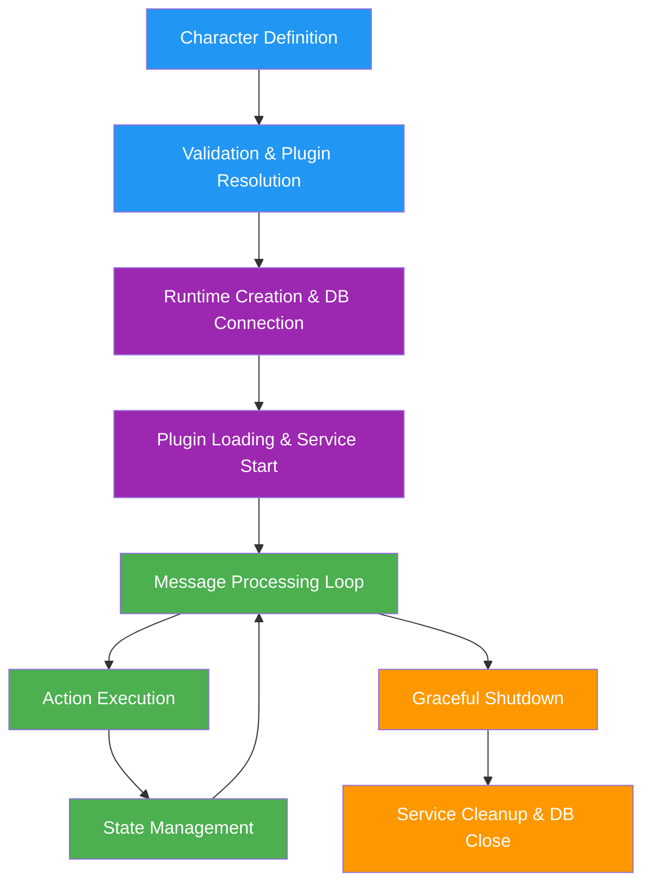

# Runtime and Lifecycle

> From Character configuration to live Agent execution in elizaOS

## Agent Lifecycle Overview

The journey from a static Character configuration to a live, interactive Agent involves several distinct phases, each managed by the `AgentRuntime`. For character structure details, see [Character Interface](/agents/character-interface).



## Character to Agent Transformation

### Loading Characters

Characters can be loaded from various sources:

```typescript theme={null}
// From TypeScript file
import { character } from "./character";

// From JSON file
import characterJson from "./character.json";

// From environment
const character = {
  name: process.env.AGENT_NAME || "DefaultAgent",
  bio: process.env.AGENT_BIO || "A helpful assistant",
  // ... other properties from env
};

// Dynamic loading
async function loadCharacter(source: string): Promise<Character> {
  if (source.endsWith(".json")) {
    const data = await fs.readFile(source, "utf-8");
    return JSON.parse(data);
  } else if (source.endsWith(".ts")) {
    const module = await import(source);
    return module.character || module.default;
  } else if (source.startsWith("http")) {
    const response = await fetch(source);
    return await response.json();
  }

  throw new Error(`Unknown character source: ${source}`);
}
```

### Character Validation

Before creating an agent, the character must be validated:

```typescript theme={null}
import { validateCharacter } from "@elizaos/core";

function validateAndPrepareCharacter(character: Partial<Character>): Character {
  // Required fields
  if (!character.name) {
    throw new Error("Character name is required");
  }

  if (
    !character.bio ||
    (Array.isArray(character.bio) && character.bio.length === 0)
  ) {
    throw new Error("Character bio is required");
  }

  // Set defaults
  const prepared: Character = {
    ...character,
    id: character.id || stringToUuid(character.name),
    username:
      character.username || character.name.toLowerCase().replace(/\s+/g, "_"),
    topics: character.topics || [],
    adjectives: character.adjectives || [],
    messageExamples: character.messageExamples || [],
    postExamples: character.postExamples || [],
    style: {
      all: character.style?.all || [],
      chat: character.style?.chat || [],
      post: character.style?.post || [],
    },
    settings: character.settings || {},
    secrets: character.secrets || {},
    plugins: character.plugins || [],
  };

  // Validate structure
  const validation = validateCharacter(prepared);
  if (!validation.valid) {
    throw new Error(
      `Character validation failed: ${validation.errors.join(", ")}`
    );
  }

  return prepared;
}
```

### Agent Instantiation

The transformation from Character to Agent:

```typescript theme={null}
interface Agent extends Character {
  enabled?: boolean;
  status?: AgentStatus;
  createdAt: number;
  updatedAt: number;
}

enum AgentStatus {
  ACTIVE = "active",
  INACTIVE = "inactive",
}

// Creating an Agent from a Character
function createAgent(character: Character): Agent {
  return {
    ...character,
    enabled: true,
    status: AgentStatus.INACTIVE, // Will become ACTIVE after initialization
    createdAt: Date.now(),
    updatedAt: Date.now(),
  };
}
```

## Runtime Architecture

### AgentRuntime Core

The `AgentRuntime` is the central orchestrator:

```typescript theme={null}
export class AgentRuntime implements IAgentRuntime {
  readonly agentId: UUID;
  readonly character: Character;
  public adapter!: IDatabaseAdapter;
  readonly actions: Action[] = [];
  readonly evaluators: Evaluator[] = [];
  readonly providers: Provider[] = [];
  readonly plugins: Plugin[] = [];
  services = new Map<ServiceTypeName, Service[]>();
  models = new Map<string, ModelHandler[]>();

  constructor(opts: {
    character: Character;
    adapter?: IDatabaseAdapter;
    plugins?: Plugin[];
    settings?: RuntimeSettings;
  }) {
    this.agentId = opts.character.id || stringToUuid(opts.character.name);
    this.character = opts.character;

    if (opts.adapter) {
      this.registerDatabaseAdapter(opts.adapter);
    }

    this.characterPlugins = opts.plugins || [];
    this.settings = opts.settings || {};

    this.logger = createLogger({
      namespace: this.character.name,
    });
  }

  async initialize(): Promise<void> {
    this.logger.info("Initializing AgentRuntime...");

    // 1. Connect to database
    await this.adapter.init();

    // 2. Resolve and load plugins
    await this.loadPlugins();

    // 3. Start services
    await this.startServices();

    // 4. Initialize providers
    await this.initializeProviders();

    // 5. Set agent status
    await this.updateAgentStatus(AgentStatus.ACTIVE);

    this.isInitialized = true;
    this.logger.info("AgentRuntime initialized successfully");
  }
}
```

### Component Management

How the runtime manages different component types:

```typescript theme={null}
class AgentRuntime {
  // Action registration and management
  registerAction(action: Action): void {
    if (this.actions.find((a) => a.name === action.name)) {
      throw new Error(`Action ${action.name} already registered`);
    }

    this.actions.push(action);
    this.logger.debug(`Registered action: ${action.name}`);
  }

  // Provider registration and management
  registerProvider(provider: Provider): void {
    if (this.providers.find((p) => p.name === provider.name)) {
      throw new Error(`Provider ${provider.name} already registered`);
    }

    this.providers.push(provider);
    this.logger.debug(`Registered provider: ${provider.name}`);
  }

  // Service registration and lifecycle
  async registerService(ServiceClass: typeof Service): Promise<Service> {
    const serviceName = ServiceClass.serviceType;

    // Check if already registered
    if (this.services.has(serviceName)) {
      return this.services.get(serviceName)[0];
    }

    // Create and start service
    const service = new ServiceClass(this);
    await service.start();

    this.services.set(serviceName, [service]);
    this.logger.info(`Service ${serviceName} started`);

    return service;
  }

  // Get a registered service
  getService<T extends Service>(name: ServiceTypeName): T | null {
    const services = this.services.get(name);
    return (services?.[0] as T) || null;
  }
}
```

## Plugin Integration

### Plugin Loading Process

The complete plugin loading lifecycle:

```typescript theme={null}
class AgentRuntime {
  private async loadPlugins(): Promise<void> {
    // 1. Resolve all plugin dependencies
    const pluginsToLoad = await this.resolvePluginDependencies(
      this.characterPlugins
    );

    // 2. Sort plugins by dependency order
    const sortedPlugins = this.topologicalSort(pluginsToLoad);

    // 3. Load each plugin in order
    for (const plugin of sortedPlugins) {
      await this.registerPlugin(plugin);
    }
  }

  private async resolvePluginDependencies(
    plugins: Plugin[]
  ): Promise<Plugin[]> {
    const resolved = new Map<string, Plugin>();
    const queue = [...plugins];

    while (queue.length > 0) {
      const plugin = queue.shift()!;

      if (resolved.has(plugin.name)) continue;
      resolved.set(plugin.name, plugin);

      // Add dependencies to queue
      if (plugin.dependencies) {
        for (const depName of plugin.dependencies) {
          const dep = this.allAvailablePlugins.get(depName);
          if (dep && !resolved.has(depName)) {
            queue.push(dep);
          }
        }
      }
    }

    return Array.from(resolved.values());
  }

  async registerPlugin(plugin: Plugin): Promise<void> {
    this.logger.info(`Registering plugin: ${plugin.name}`);

    // 1. Call plugin's init function
    if (plugin.init) {
      await plugin.init(plugin.config || {}, this);
    }

    // 2. Register services
    if (plugin.services) {
      for (const ServiceClass of plugin.services) {
        await this.registerService(ServiceClass);
      }
    }

    // 3. Register actions
    if (plugin.actions) {
      for (const action of plugin.actions) {
        this.registerAction(action);
      }
    }

    // 4. Register providers
    if (plugin.providers) {
      for (const provider of plugin.providers) {
        this.registerProvider(provider);
      }
    }

    // 5. Register evaluators
    if (plugin.evaluators) {
      for (const evaluator of plugin.evaluators) {
        this.registerEvaluator(evaluator);
      }
    }

    // 6. Register models
    if (plugin.models) {
      for (const [type, handler] of Object.entries(plugin.models)) {
        this.registerModel(type, handler, plugin.name, plugin.priority);
      }
    }

    this.plugins.push(plugin);
    this.logger.info(`Plugin ${plugin.name} registered successfully`);
  }
}
```

### Plugin Lifecycle Hooks

Plugins can hook into various lifecycle events:

```typescript theme={null}
interface Plugin {
  // Initialization - called when plugin is loaded
  init?: (config: any, runtime: IAgentRuntime) => Promise<void>;

  // Start - called when runtime starts
  start?: (runtime: IAgentRuntime) => Promise<void>;

  // Stop - called when runtime stops
  stop?: (runtime: IAgentRuntime) => Promise<void>;

  // Message hooks
  beforeMessage?: (message: Memory, runtime: IAgentRuntime) => Promise<Memory>;
  afterMessage?: (
    message: Memory,
    response: Memory,
    runtime: IAgentRuntime
  ) => Promise<void>;

  // Action hooks
  beforeAction?: (
    action: Action,
    message: Memory,
    runtime: IAgentRuntime
  ) => Promise<boolean>;
  afterAction?: (
    action: Action,
    result: any,
    runtime: IAgentRuntime
  ) => Promise<void>;
}

// Example plugin with lifecycle hooks
const lifecyclePlugin: Plugin = {
  name: "lifecycle-example",

  async init(config, runtime) {
    console.log("Plugin initializing...");
    // Setup plugin resources
  },

  async start(runtime) {
    console.log("Plugin starting...");
    // Start background tasks
  },

  async stop(runtime) {
    console.log("Plugin stopping...");
    // Cleanup resources
  },

  async beforeMessage(message, runtime) {
    // Modify or validate message before processing
    return {
      ...message,
      metadata: {
        ...message.metadata,
        preprocessed: true,
      },
    };
  },

  async afterMessage(message, response, runtime) {
    // Log, analyze, or store conversation
    await runtime.createMemory({
      content: {
        text: `Processed: ${message.content.text}`,
        metadata: { type: "conversation_log" },
      },
    });
  },
};
```

## Component Orchestration

### Action Selection and Execution

How the runtime selects and executes actions:

```typescript theme={null}
class ActionOrchestrator {
  async selectAction(
    runtime: IAgentRuntime,
    message: Memory,
    state: State
  ): Promise<Action | null> {
    // 1. Get all available actions
    const availableActions = runtime.actions;

    // 2. Validate which actions can handle this message
    const validActions = await Promise.all(
      availableActions.map(async (action) => {
        try {
          const isValid = await action.validate?.(runtime, message, state);
          return isValid ? action : null;
        } catch (error) {
          runtime.logger.error(`Validation error for ${action.name}:`, error);
          return null;
        }
      })
    );

    const candidates = validActions.filter(Boolean);

    if (candidates.length === 0) return null;

    // 3. Use LLM to select best action
    const selectedAction = await this.selectWithLLM(
      runtime,
      candidates,
      message,
      state
    );

    return selectedAction;
  }

  async executeAction(
    runtime: IAgentRuntime,
    action: Action,
    message: Memory,
    state: State
  ): Promise<ActionResult> {
    const startTime = Date.now();

    try {
      // Pre-execution hook
      if (runtime.currentPlugin?.beforeAction) {
        const shouldContinue = await runtime.currentPlugin.beforeAction(
          action,
          message,
          runtime
        );
        if (!shouldContinue) {
          return { success: false, reason: "Blocked by plugin" };
        }
      }

      // Execute action
      const result = await action.handler(
        runtime,
        message,
        state,
        {},
        (response) => {
          // Callback for streaming responses
          runtime.emit("action:response", { action: action.name, response });
        }
      );

      // Post-execution hook
      if (runtime.currentPlugin?.afterAction) {
        await runtime.currentPlugin.afterAction(action, result, runtime);
      }

      // Log execution
      runtime.logger.info(
        `Action ${action.name} executed in ${Date.now() - startTime}ms`
      );

      return {
        success: true,
        data: result,
        executionTime: Date.now() - startTime,
      };
    } catch (error) {
      runtime.logger.error(`Action ${action.name} failed:`, error);
      return {
        success: false,
        error: error.message,
        executionTime: Date.now() - startTime,
      };
    }
  }
}
```

### Provider Composition

How providers contribute to state:

```typescript theme={null}
class ProviderOrchestrator {
  async composeState(runtime: IAgentRuntime, message: Memory): Promise<State> {
    const state: State = {
      messages: [],
      facts: [],
      providers: {},
      context: "",
      metadata: {
        roomId: message.roomId,
        entityId: message.entityId,
        timestamp: Date.now(),
        tokenCount: 0,
      },
    };

    // 1. Get recent messages
    state.messages = await runtime.getMemories({
      roomId: message.roomId,
      count: runtime.conversationLength,
    });

    // 2. Run all providers in parallel
    const providerPromises = runtime.providers.map(async (provider) => {
      try {
        const result = await provider.get(runtime, message, state);
        return { name: provider.name, result };
      } catch (error) {
        runtime.logger.error(`Provider ${provider.name} failed:`, error);
        return null;
      }
    });

    const providerResults = await Promise.all(providerPromises);

    // 3. Merge provider data into state
    for (const item of providerResults) {
      if (!item) continue;

      state.providers[item.name] = {
        text: item.result.text || "",
        data: item.result.data || {},
      };

      // Add to context
      if (item.result.text) {
        state.context += `\n[${item.name.toUpperCase()}]\n${item.result.text}\n`;
      }
    }

    // 4. Calculate token count
    state.metadata.tokenCount = this.estimateTokens(state.context);

    return state;
  }
}
```

### Evaluator Execution

Post-processing with evaluators:

```typescript theme={null}
class EvaluatorOrchestrator {
  async runEvaluators(
    runtime: IAgentRuntime,
    message: Memory,
    response: Memory,
    state: State
  ): Promise<EvaluationResults> {
    const results: EvaluationResults = {};

    // Filter evaluators that should run
    const evaluatorsToRun = runtime.evaluators.filter((evaluator) => {
      // Always run if marked as alwaysRun
      if (evaluator.alwaysRun) return true;

      // Run if agent responded
      if (response) return true;

      // Check custom conditions
      return evaluator.shouldRun?.(message, state);
    });

    // Run evaluators in parallel
    const evaluationPromises = evaluatorsToRun.map(async (evaluator) => {
      try {
        const result = await evaluator.handler(
          runtime,
          message,
          state,
          {},
          () => {}, // Callback
          [response] // Response array
        );

        return { name: evaluator.name, result };
      } catch (error) {
        runtime.logger.error(`Evaluator ${evaluator.name} failed:`, error);
        return { name: evaluator.name, error };
      }
    });

    const evaluations = await Promise.all(evaluationPromises);

    // Process results
    for (const evaluation of evaluations) {
      if (evaluation.error) {
        results[evaluation.name] = { success: false, error: evaluation.error };
      } else {
        results[evaluation.name] = { success: true, data: evaluation.result };
      }
    }

    // Store evaluation results
    await this.storeEvaluations(runtime, message, response, results);

    return results;
  }
}
```

## Service Management

### Service Registration

Services are long-running components:

```typescript theme={null}
abstract class Service {
  static serviceType: ServiceTypeName;
  status: ServiceStatus = ServiceStatus.STOPPED;
  runtime: IAgentRuntime;

  constructor(runtime: IAgentRuntime) {
    this.runtime = runtime;
  }

  abstract start(): Promise<void>;
  abstract stop(): Promise<void>;
}

// Example service implementation
class WebSocketService extends Service {
  static serviceType = "websocket" as ServiceTypeName;
  private ws: WebSocket | null = null;

  async start(): Promise<void> {
    this.ws = new WebSocket(this.runtime.getSetting("WS_URL"));

    this.ws.on("open", () => {
      this.status = ServiceStatus.RUNNING;
      this.runtime.logger.info("WebSocket connected");
    });

    this.ws.on("message", async (data) => {
      await this.handleMessage(data);
    });

    this.ws.on("error", (error) => {
      this.runtime.logger.error("WebSocket error:", error);
      this.status = ServiceStatus.ERROR;
    });
  }

  async stop(): Promise<void> {
    if (this.ws) {
      this.ws.close();
      this.ws = null;
    }
    this.status = ServiceStatus.STOPPED;
  }

  private async handleMessage(data: any) {
    // Process incoming websocket messages
    const message = JSON.parse(data);
    await this.runtime.processMessage(message);
  }
}
```

### Service Lifecycle

Managing service dependencies and lifecycle:

```typescript theme={null}
class ServiceManager {
  private services = new Map<ServiceTypeName, Service>();
  private startOrder: ServiceTypeName[] = [];

  async startServices(runtime: IAgentRuntime): Promise<void> {
    // Determine start order based on dependencies
    this.startOrder = this.resolveServiceDependencies();

    for (const serviceName of this.startOrder) {
      const ServiceClass = this.getServiceClass(serviceName);
      if (!ServiceClass) continue;

      try {
        const service = new ServiceClass(runtime);
        await service.start();
        this.services.set(serviceName, service);
        runtime.logger.info(`Service ${serviceName} started`);
      } catch (error) {
        runtime.logger.error(`Failed to start service ${serviceName}:`, error);
        // Decide whether to continue or abort
        if (this.isRequiredService(serviceName)) {
          throw error;
        }
      }
    }
  }

  async stopServices(runtime: IAgentRuntime): Promise<void> {
    // Stop in reverse order
    const stopOrder = [...this.startOrder].reverse();

    for (const serviceName of stopOrder) {
      const service = this.services.get(serviceName);
      if (!service) continue;

      try {
        await service.stop();
        runtime.logger.info(`Service ${serviceName} stopped`);
      } catch (error) {
        runtime.logger.error(`Error stopping service ${serviceName}:`, error);
      }
    }

    this.services.clear();
  }

  async restartService(
    runtime: IAgentRuntime,
    serviceName: ServiceTypeName
  ): Promise<void> {
    const service = this.services.get(serviceName);

    if (service) {
      await service.stop();
    }

    const ServiceClass = this.getServiceClass(serviceName);
    const newService = new ServiceClass(runtime);
    await newService.start();

    this.services.set(serviceName, newService);
  }
}
```

## Multi-agent Systems

### Agent Coordination

Managing multiple agents in a system:

```typescript theme={null}
class MultiAgentCoordinator {
  private agents = new Map<UUID, IAgentRuntime>();
  private messageQueue = new Map<UUID, Memory[]>();

  async registerAgent(agent: IAgentRuntime): Promise<void> {
    this.agents.set(agent.agentId, agent);
    this.messageQueue.set(agent.agentId, []);

    // Setup inter-agent communication
    agent.on("message:send", async (data) => {
      await this.routeMessage(data.from, data.to, data.message);
    });
  }

  async routeMessage(
    fromAgent: UUID,
    toAgent: UUID,
    message: Memory
  ): Promise<void> {
    const targetAgent = this.agents.get(toAgent);

    if (!targetAgent) {
      // Queue message for offline agent
      this.messageQueue.get(toAgent)?.push(message);
      return;
    }

    // Deliver message
    await targetAgent.processMessage({
      ...message,
      metadata: {
        ...message.metadata,
        fromAgent,
        interAgent: true,
      },
    });
  }

  async broadcastMessage(fromAgent: UUID, message: Memory): Promise<void> {
    const promises = Array.from(this.agents.entries())
      .filter(([id]) => id !== fromAgent)
      .map(([id, agent]) => agent.processMessage(message));

    await Promise.all(promises);
  }
}
```

### Agent Hierarchies

Parent-child agent relationships:

```typescript theme={null}
interface AgentHierarchy {
  parent?: UUID;
  children: UUID[];
  permissions: {
    canCreateChildren: boolean;
    canControlChildren: boolean;
    canAccessParentMemory: boolean;
  };
}

class HierarchicalAgentSystem {
  private hierarchy = new Map<UUID, AgentHierarchy>();

  async createChildAgent(
    parentRuntime: IAgentRuntime,
    childCharacter: Character
  ): Promise<IAgentRuntime> {
    // Inherit settings from parent
    const childCharacter: Character = {
      ...childCharacter,
      settings: {
        ...parentRuntime.character.settings,
        ...childCharacter.settings,
      },
      // Inherit some plugins
      plugins: [
        ...parentRuntime.character.plugins.filter((p) => this.isInheritable(p)),
        ...childCharacter.plugins,
      ],
    };

    // Create child runtime
    const childRuntime = new AgentRuntime({
      character: childCharacter,
      adapter: parentRuntime.adapter, // Share database
      settings: parentRuntime.settings,
    });

    await childRuntime.initialize();

    // Update hierarchy
    this.hierarchy.set(childRuntime.agentId, {
      parent: parentRuntime.agentId,
      children: [],
      permissions: {
        canCreateChildren: false,
        canControlChildren: false,
        canAccessParentMemory: true,
      },
    });

    // Update parent's children list
    const parentHierarchy = this.hierarchy.get(parentRuntime.agentId);
    if (parentHierarchy) {
      parentHierarchy.children.push(childRuntime.agentId);
    }

    return childRuntime;
  }

  async delegateTask(
    parentRuntime: IAgentRuntime,
    childId: UUID,
    task: Task
  ): Promise<TaskResult> {
    const childRuntime = this.agents.get(childId);

    if (!childRuntime) {
      throw new Error(`Child agent ${childId} not found`);
    }

    // Check permissions
    const hierarchy = this.hierarchy.get(parentRuntime.agentId);
    if (!hierarchy?.children.includes(childId)) {
      throw new Error("No authority over this agent");
    }

    // Delegate task
    return await childRuntime.executeTask(task);
  }
}
```

## Production Considerations

### Initialization Strategies

Different approaches for production deployment:

```typescript theme={null}
// Lazy initialization - start minimal, load as needed
class LazyRuntime extends AgentRuntime {
  private loadedPlugins = new Set<string>();

  async initialize(): Promise<void> {
    // Load only core plugins
    await this.loadCorePlugins();
    this.isInitialized = true;
  }

  async loadPlugin(pluginName: string): Promise<void> {
    if (this.loadedPlugins.has(pluginName)) return;

    const plugin = await this.fetchPlugin(pluginName);
    await this.registerPlugin(plugin);
    this.loadedPlugins.add(pluginName);
  }

  // Load plugin on first use
  async getAction(name: string): Promise<Action | null> {
    let action = this.actions.find((a) => a.name === name);

    if (!action) {
      // Try to load plugin that provides this action
      const pluginName = this.findPluginForAction(name);
      if (pluginName) {
        await this.loadPlugin(pluginName);
        action = this.actions.find((a) => a.name === name);
      }
    }

    return action;
  }
}

// Eager initialization - load everything upfront
class EagerRuntime extends AgentRuntime {
  async initialize(): Promise<void> {
    // Load all plugins immediately
    await this.loadAllPlugins();

    // Pre-warm caches
    await this.prewarmCaches();

    // Pre-compile templates
    await this.compileTemplates();

    this.isInitialized = true;
  }
}
```

### Error Recovery

Implementing robust error handling:

```typescript theme={null}
class ResilientRuntime extends AgentRuntime {
  private errorCount = new Map<string, number>();
  private circuitBreakers = new Map<string, CircuitBreaker>();

  async processMessageWithRecovery(message: Memory): Promise<void> {
    const maxRetries = 3;
    let lastError: Error | null = null;

    for (let attempt = 1; attempt <= maxRetries; attempt++) {
      try {
        // Check circuit breaker
        const breaker = this.circuitBreakers.get("message_processing");
        if (breaker?.isOpen()) {
          throw new Error("Circuit breaker is open");
        }

        await this.processMessage(message);

        // Reset error count on success
        this.errorCount.set("message_processing", 0);
        return;
      } catch (error) {
        lastError = error;
        this.logger.error(`Attempt ${attempt} failed:`, error);

        // Update error count
        const count = (this.errorCount.get("message_processing") || 0) + 1;
        this.errorCount.set("message_processing", count);

        // Trip circuit breaker if too many errors
        if (count > 10) {
          this.circuitBreakers.get("message_processing")?.trip();
        }

        // Exponential backoff
        if (attempt < maxRetries) {
          await this.sleep(Math.pow(2, attempt) * 1000);
        }
      }
    }

    // All retries failed
    await this.handleCriticalError(lastError!, message);
  }

  private async handleCriticalError(
    error: Error,
    message: Memory
  ): Promise<void> {
    // Log to error tracking service
    await this.logToErrorService(error, {
      message,
      agentId: this.agentId,
      timestamp: Date.now(),
    });

    // Send fallback response
    await this.sendFallbackResponse(message);

    // Notify administrators
    await this.notifyAdmins(error);
  }
}
```

### Monitoring and Metrics

Production monitoring implementation:

```typescript theme={null}
interface RuntimeMetrics {
  messagesProcessed: number;
  averageResponseTime: number;
  errorRate: number;
  memoryUsage: number;
  activeServices: number;
  pluginPerformance: Map<string, PluginMetrics>;
}

class MonitoredRuntime extends AgentRuntime {
  private metrics: RuntimeMetrics = {
    messagesProcessed: 0,
    averageResponseTime: 0,
    errorRate: 0,
    memoryUsage: 0,
    activeServices: 0,
    pluginPerformance: new Map(),
  };

  async processMessage(message: Memory): Promise<void> {
    const startTime = Date.now();

    try {
      await super.processMessage(message);

      // Update metrics
      this.metrics.messagesProcessed++;
      this.updateAverageResponseTime(Date.now() - startTime);
    } catch (error) {
      this.metrics.errorRate = this.calculateErrorRate();
      throw error;
    } finally {
      // Collect memory usage
      this.metrics.memoryUsage = process.memoryUsage().heapUsed;

      // Send metrics
      await this.sendMetrics();
    }
  }

  private async sendMetrics(): Promise<void> {
    // Send to monitoring service (e.g., Prometheus, DataDog)
    await fetch(process.env.METRICS_ENDPOINT!, {
      method: "POST",
      body: JSON.stringify({
        agentId: this.agentId,
        timestamp: Date.now(),
        metrics: this.metrics,
      }),
    });
  }

  // Health check endpoint
  async getHealth(): Promise<HealthStatus> {
    return {
      status: this.isHealthy() ? "healthy" : "unhealthy",
      uptime: process.uptime(),
      metrics: this.metrics,
      services: Array.from(this.services.entries()).map(([name, services]) => ({
        name,
        status: services[0]?.status || "unknown",
      })),
    };
  }
}
```

### Scaling Strategies

Horizontal scaling approaches:

```typescript theme={null}
// Load balancer for multiple agent instances
class AgentLoadBalancer {
  private instances: IAgentRuntime[] = [];
  private currentIndex = 0;

  async addInstance(character: Character): Promise<void> {
    const runtime = new AgentRuntime({ character });
    await runtime.initialize();
    this.instances.push(runtime);
  }

  // Round-robin load balancing
  getNextInstance(): IAgentRuntime {
    const instance = this.instances[this.currentIndex];
    this.currentIndex = (this.currentIndex + 1) % this.instances.length;
    return instance;
  }

  // Load-based routing
  getLeastLoadedInstance(): IAgentRuntime {
    return this.instances.reduce((least, current) => {
      const leastLoad = least.getMetrics().activeRequests;
      const currentLoad = current.getMetrics().activeRequests;
      return currentLoad < leastLoad ? current : least;
    });
  }

  async scaleUp(): Promise<void> {
    const baseCharacter = this.instances[0].character;
    await this.addInstance(baseCharacter);
  }

  async scaleDown(): Promise<void> {
    if (this.instances.length <= 1) return;

    const instance = this.instances.pop();
    await instance?.stop();
  }
}
```

## Deployment Patterns

### Single Agent Deployment

Basic deployment for a single agent:

```typescript theme={null}
// server.ts
import { AgentRuntime } from "@elizaos/core";
import { PostgresDatabaseAdapter } from "@elizaos/plugin-sql";
import { character } from "./character";

async function startAgent() {
  // Create database adapter
  const adapter = new PostgresDatabaseAdapter({
    connectionString: process.env.DATABASE_URL,
  });

  // Create runtime
  const runtime = new AgentRuntime({
    character,
    adapter,
    settings: {
      logLevel: process.env.LOG_LEVEL || "info",
    },
  });

  // Initialize
  await runtime.initialize();

  // Start HTTP server for API
  const app = express();

  app.post("/message", async (req, res) => {
    try {
      const response = await runtime.processMessage(req.body);
      res.json(response);
    } catch (error) {
      res.status(500).json({ error: error.message });
    }
  });

  app.get("/health", async (req, res) => {
    const health = await runtime.getHealth();
    res.json(health);
  });

  app.listen(process.env.PORT || 3000);

  // Graceful shutdown
  process.on("SIGTERM", async () => {
    await runtime.stop();
    process.exit(0);
  });
}

startAgent().catch(console.error);
```

### Agent Swarm Deployment

Managing multiple agents:

```typescript theme={null}
class AgentSwarm {
  private agents = new Map<UUID, IAgentRuntime>();
  private coordinator: MultiAgentCoordinator;

  async deploySwarm(characters: Character[]): Promise<void> {
    // Shared database for all agents
    const adapter = new PostgresDatabaseAdapter({
      connectionString: process.env.DATABASE_URL,
    });

    // Deploy each agent
    for (const character of characters) {
      const runtime = new AgentRuntime({
        character,
        adapter,
        settings: this.getSwarmSettings(),
      });

      await runtime.initialize();
      this.agents.set(runtime.agentId, runtime);

      // Register with coordinator
      await this.coordinator.registerAgent(runtime);
    }

    // Setup swarm communication
    await this.setupSwarmCommunication();
  }

  private async setupSwarmCommunication(): Promise<void> {
    // Create message bus for inter-agent communication
    const messageBus = new EventEmitter();

    for (const [id, agent] of this.agents) {
      // Subscribe to agent's outgoing messages
      agent.on("message:external", (data) => {
        messageBus.emit("swarm:message", {
          from: id,
          ...data,
        });
      });

      // Route swarm messages to agent
      messageBus.on("swarm:message", async (data) => {
        if (data.to === id || data.broadcast) {
          await agent.processMessage(data.message);
        }
      });
    }
  }
}
```

### Edge Deployment

Optimized for resource-constrained environments:

```typescript theme={null}
class EdgeRuntime extends AgentRuntime {
  constructor(opts: EdgeRuntimeOptions) {
    super({
      ...opts,
      // Use lightweight alternatives
      adapter: new SQLiteAdapter({
        path: "./agent.db",
      }),
      settings: {
        ...opts.settings,
        // Reduce resource usage
        maxMemorySize: 100, // Smaller memory buffer
        conversationLength: 10, // Shorter context
        cacheSize: 50, // Smaller cache
      },
    });
  }

  async initialize(): Promise<void> {
    // Load only essential plugins
    const essentialPlugins = this.characterPlugins.filter((p) =>
      this.isEssential(p.name)
    );

    this.characterPlugins = essentialPlugins;
    await super.initialize();

    // Enable offline mode
    await this.enableOfflineMode();
  }

  private async enableOfflineMode(): Promise<void> {
    // Cache common responses
    await this.cacheCommonResponses();

    // Use local models if available
    if (await this.hasLocalModel()) {
      this.registerModel("local", this.localModelHandler);
    }

    // Setup sync when online
    this.setupSyncWhenOnline();
  }

  private setupSyncWhenOnline(): void {
    setInterval(async () => {
      if (await this.isOnline()) {
        await this.syncWithCloud();
      }
    }, 60000); // Check every minute
  }
}
```

## Best Practices

1. **Initialize once**: Create the runtime once and reuse it for all operations
2. **Handle lifecycle properly**: Always call stop() for graceful shutdown
3. **Monitor health**: Implement health checks and metrics
4. **Use dependency injection**: Pass runtime to components rather than importing globally
5. **Implement circuit breakers**: Prevent cascading failures
6. **Log strategically**: Log important events but avoid logging sensitive data
7. **Cache appropriately**: Cache expensive operations but manage memory
8. **Version your deployments**: Track which version of agents are running
9. **Test in production-like environments**: Use similar resources and configurations
10. **Plan for failure**: Implement fallbacks and recovery strategies

## Troubleshooting

### Common Runtime Issues

#### Agent Not Responding

```typescript theme={null}
async function debugUnresponsiveAgent(runtime: IAgentRuntime) {
  // Check initialization
  console.log("Is initialized:", runtime.isInitialized);

  // Check services
  const services = runtime.getServices();
  for (const [name, service] of services) {
    console.log(`Service ${name}: ${service.status}`);
  }

  // Check action availability
  console.log(
    "Available actions:",
    runtime.actions.map((a) => a.name)
  );

  // Check database connection
  try {
    await runtime.adapter.ping();
    console.log("Database: Connected");
  } catch (error) {
    console.log("Database: Disconnected", error);
  }

  // Check memory usage
  const usage = process.memoryUsage();
  console.log("Memory usage:", {
    rss: `${Math.round(usage.rss / 1024 / 1024)}MB`,
    heap: `${Math.round(usage.heapUsed / 1024 / 1024)}MB`,
  });
}
```

#### Plugin Loading Failures

```typescript theme={null}
async function debugPluginLoading(runtime: IAgentRuntime, pluginName: string) {
  try {
    // Check if plugin exists
    const plugin = runtime.allAvailablePlugins.get(pluginName);
    if (!plugin) {
      console.log(`Plugin ${pluginName} not found in available plugins`);
      return;
    }

    // Check dependencies
    if (plugin.dependencies) {
      for (const dep of plugin.dependencies) {
        const depPlugin = runtime.plugins.find((p) => p.name === dep);
        if (!depPlugin) {
          console.log(`Missing dependency: ${dep}`);
        }
      }
    }

    // Try loading manually
    await runtime.registerPlugin(plugin);
    console.log(`Plugin ${pluginName} loaded successfully`);
  } catch (error) {
    console.log(`Plugin loading error:`, error);
  }
}
```

<Tip>
  **Guide**: [Customize an Agent](/guides/customize-an-agent)
</Tip>

## See Also

<CardGroup cols={2}>
  <Card title="Character Interface" icon="code" href="/agents/character-interface">
    Define your agent's character configuration
  </Card>

  <Card title="Personality & Behavior" icon="user" href="/agents/personality-and-behavior">
    Craft unique agent personalities
  </Card>

  <Card title="Memory & State" icon="brain" href="/agents/memory-and-state">
    Understand agent memory and context
  </Card>

  <Card title="Plugin Development" icon="puzzle" href="/plugins/development">
    Extend runtime capabilities with plugins
  </Card>
</CardGroup>

---

> To find navigation and other pages in this documentation, fetch the llms.txt file at: https://docs.elizaos.ai/llms.txt
