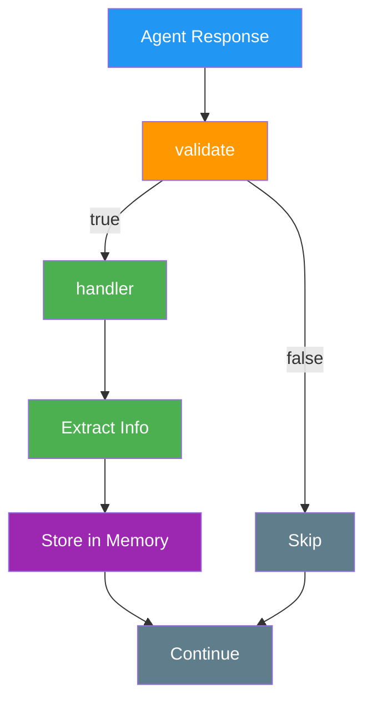

# Components

> Actions, Providers, Evaluators, and Services - the building blocks of elizaOS plugins

## Overview

Plugin components are the building blocks that give agents their capabilities. Each component type serves a specific purpose in the agent's decision-making and interaction flow. For system architecture, see [Plugin Architecture](/plugins/architecture).

## Component Types

| Component      | Purpose                            | When Executed                     |
| -------------- | ---------------------------------- | --------------------------------- |
| **Actions**    | Tasks agents can perform           | When agent decides to take action |
| **Providers**  | Supply contextual data             | Before actions/decisions          |
| **Evaluators** | Process and extract from responses | After agent generates response    |
| **Services**   | Manage stateful connections        | Throughout agent lifecycle        |

## Actions

Actions are discrete tasks agents can perform. They represent the agent's capabilities - what it can DO.

### Action Interface

Actions define discrete tasks that agents can perform. Each action has:

- **name**: Unique identifier for the action
- **description**: Clear explanation of what the action does
- **similes**: Alternative names or aliases for fuzzy matching
- **examples**: Training examples showing when to use the action
- **validate**: Function to check if the action can run in the current context
- **handler**: The execution logic that returns an `ActionResult`

The handler receives the runtime, message, state, options (for action chaining), an optional callback for intermediate responses, and previous responses.

**Important**: All action handlers must return an `ActionResult` with a `success` field indicating whether the action completed successfully.

For complete interface definitions, see [Plugin Reference](/plugins/reference#action-interface).

### Core Actions (Bootstrap Plugin)

The bootstrap plugin provides 13 essential actions:

#### Communication Actions

| Action         | Description           | Example Trigger       |
| -------------- | --------------------- | --------------------- |
| `REPLY`        | Generate response     | "Tell me about..."    |
| `SEND_MESSAGE` | Send to specific room | "Message the team..." |
| `NONE`         | Acknowledge silently  | "Thanks!"             |
| `IGNORE`       | Skip message          | Spam/irrelevant       |

#### Room Management

| Action          | Description          | Example Trigger     |
| --------------- | -------------------- | ------------------- |
| `FOLLOW_ROOM`   | Subscribe to updates | "Join #general"     |
| `UNFOLLOW_ROOM` | Unsubscribe          | "Leave #general"    |
| `MUTE_ROOM`     | Mute notifications   | "Mute this channel" |
| `UNMUTE_ROOM`   | Unmute               | "Unmute #general"   |

#### Data & Configuration

| Action            | Description         | Example Trigger      |
| ----------------- | ------------------- | -------------------- |
| `UPDATE_CONTACT`  | Update contact info | "Remember that I..." |
| `UPDATE_ROLE`     | Change roles        | "Make me admin"      |
| `UPDATE_SETTINGS` | Modify settings     | "Set model to gpt-4" |

#### Media & Utilities

| Action           | Description      | Example Trigger    |
| ---------------- | ---------------- | ------------------ |
| `GENERATE_IMAGE` | Create AI images | "Draw a cat"       |
| `CHOICE`         | Present options  | "Should I A or B?" |

### Creating Actions

For advanced patterns, see [Plugin Patterns](/plugins/patterns).

#### Minimal Action

```typescript theme={null}
const action: Action = {
  name: "MY_ACTION",
  description: "Does something",
  validate: async () => true,
  handler: async (runtime, message) => {
    return {
      success: true, // REQUIRED
      text: "Done!",
    };
  },
};
```

#### With Validation

```typescript theme={null}
const sendTokenAction: Action = {
  name: "SEND_TOKEN",
  description: "Send tokens to address",

  validate: async (runtime, message) => {
    return message.content.includes("send") && message.content.includes("0x");
  },

  handler: async (runtime, message) => {
    const address = extractAddress(message.content);
    const amount = extractAmount(message.content);
    await sendToken(address, amount);
    return {
      success: true,
      text: `Sent ${amount} tokens to ${address}`,
    };
  },
};
```

#### With Examples

```typescript theme={null}
const action: Action = {
  name: "WEATHER",
  description: "Get weather info",
  examples: [
    [
      { name: "user", content: { text: "What's the weather?" } },
      { name: "agent", content: { text: "Let me check the weather for you." } },
    ],
  ],
  validate: async (runtime, message) => {
    return message.content.toLowerCase().includes("weather");
  },
  handler: async (runtime, message) => {
    const weather = await fetchWeather();
    return {
      success: true,
      text: `It's ${weather.temp}°C and ${weather.condition}`,
    };
  },
};
```

### Handler Patterns

```typescript theme={null}
// Using callbacks
handler: async (runtime, message, state, options, callback) => {
  const result = await doWork();
  if (callback) {
    await callback({ text: result }, []);
  }
  return { success: true, text: result };
};

// Using services
handler: async (runtime, message) => {
  const service = runtime.getService<TwitterService>("twitter");
  return service.post(message.content);
};

// Using database
handler: async (runtime, message) => {
  const memories = await runtime.databaseAdapter.searchMemories({
    query: message.content,
    limit: 5,
  });
  return { success: true, data: { memories } };
};
```

### Best Practices for Actions

- Name actions clearly (VERB_NOUN format)
- Always return ActionResult with `success` field
- Validate before executing
- Return consistent response format
- Use similes for alternative triggers
- Provide diverse examples
- Handle errors gracefully

## Providers

Providers supply contextual information to the agent's state before it makes decisions. They act as the agent's "senses", gathering relevant data.

### Provider Interface

Providers supply contextual data to enhance agent decision-making. Each provider has:

- **name**: Unique identifier for the provider
- **description**: Optional explanation of what data it provides
- **dynamic**: If true, data is re-fetched each time (not cached)
- **position**: Execution order priority (-100 to 100, lower runs first)
- **private**: If true, hidden from the default provider list
- **get**: Function that returns a `ProviderResult` with text, values, and data

The `get` function receives the runtime, current message, and state, returning data that will be composed into the agent's context.

For complete interface definitions, see the [Provider Interface in the Reference](/plugins/reference#provider-interface).

### Core Providers (Bootstrap Plugin)

| Provider                 | Returns           | Example Use          |
| ------------------------ | ----------------- | -------------------- |
| `characterProvider`      | Agent personality | Name, bio, traits    |
| `timeProvider`           | Current date/time | "What time is it?"   |
| `knowledgeProvider`      | Knowledge base    | Documentation, facts |
| `recentMessagesProvider` | Chat history      | Context awareness    |
| `actionsProvider`        | Available actions | "What can you do?"   |
| `factsProvider`          | Stored facts      | User preferences     |
| `settingsProvider`       | Configuration     | Model settings       |

### Creating Providers

#### Basic Provider

```typescript theme={null}
const provider: Provider = {
  name: "MY_DATA",
  get: async (runtime, message, state) => {
    return {
      text: "Contextual information",
      data: { key: "value" },
    };
  },
};
```

#### Dynamic Provider

```typescript theme={null}
const dynamicProvider: Provider = {
  name: "LIVE_DATA",
  dynamic: true, // Re-fetched each time
  get: async (runtime) => {
    const data = await fetchLatestData();
    return { data };
  },
};
```

#### Private Provider

```typescript theme={null}
const secretProvider: Provider = {
  name: "INTERNAL_STATE",
  private: true, // Not shown in provider list
  get: async (runtime) => {
    return runtime.getInternalState();
  },
};
```

### Provider Priority

```typescript theme={null}
// Lower numbers = higher priority
position: -100; // Loads first
position: 0; // Default
position: 100; // Loads last
```

### Provider Execution Flow

1. Providers are executed during `runtime.composeState()`
2. By default, all non-private, non-dynamic providers are included
3. Providers are sorted by position and executed in order
4. Results are aggregated into a unified state object
5. The composed state is passed to actions and the LLM for decision-making

### Best Practices for Providers

- Return consistent data structures
- Handle errors gracefully
- Cache when appropriate
- Keep data fetching fast
- Document what data is provided
- Use position to control execution order

## Evaluators

Evaluators are post-processors that analyze and extract information from conversations.

### Evaluator Interface

Evaluators process and extract information from agent responses. Each evaluator has:

- **name**: Unique identifier for the evaluator
- **description**: Explanation of what it evaluates or extracts
- **similes**: Alternative names for matching
- **alwaysRun**: If true, runs on every agent response
- **examples**: Training examples for the evaluator
- **validate**: Function to determine if evaluator should run
- **handler**: Processing logic that analyzes the response

Evaluators run after an agent generates a response, allowing for fact extraction, sentiment analysis, or content filtering.

For complete interface definitions, see the [Evaluator Interface in the Reference](/plugins/reference#evaluator-interface).

### Core Evaluators (Bootstrap Plugin)

| Evaluator             | Purpose         | Extracts                    |
| --------------------- | --------------- | --------------------------- |
| `reflectionEvaluator` | Self-awareness  | Insights about interactions |
| `factEvaluator`       | Fact extraction | Important information       |
| `goalEvaluator`       | Goal tracking   | User objectives             |

### Evaluator Flow



### Common Use Cases

#### Memory Building

- Extract facts from conversations
- Track user preferences
- Update relationship status
- Record important events

#### Content Filtering

- Remove sensitive data
- Filter profanity
- Ensure compliance
- Validate accuracy

#### Analytics

- Track sentiment
- Measure engagement
- Monitor topics
- Analyze patterns

### Creating Evaluators

#### Basic Evaluator

```typescript theme={null}
const evaluator: Evaluator = {
  name: "my-evaluator",
  description: "Processes responses",
  examples: [], // Training examples

  validate: async (runtime, message) => {
    return true; // Run on all messages
  },

  handler: async (runtime, message) => {
    // Process and extract
    const result = await analyze(message);
    // Store findings
    await storeResult(result);
    return result;
  },
};
```

#### With Examples

```typescript theme={null}
const evaluator: Evaluator = {
  name: "fact-extractor",
  description: "Extracts facts from conversations",
  examples: [
    {
      prompt: "Extract facts from this conversation",
      messages: [
        { name: "user", content: { text: "I live in NYC" } },
        { name: "agent", content: { text: "NYC is a great city!" } },
      ],
      outcome: "User lives in New York City",
    },
  ],
  validate: async () => true,
  handler: async (runtime, message, state) => {
    const facts = await extractFacts(state);
    for (const fact of facts) {
      await runtime.factsManager.addFact(fact);
    }
    return facts;
  },
};
```

### Best Practices for Evaluators

- Run evaluators async (don't block responses)
- Store extracted data for future context
- Use `alwaysRun: true` sparingly
- Provide clear examples for training
- Keep handlers lightweight

## Services

Services manage stateful connections and provide core functionality. They are singleton instances that persist throughout the agent's lifecycle.

### Service Abstract Class

Services are singleton instances that manage stateful connections and provide persistent functionality throughout the agent's lifecycle. Services extend an abstract class with:

- **serviceType**: Static property identifying the service type
- **capabilityDescription**: Description of what the service provides
- **start()**: Static method to initialize and start the service
- **stop()**: Method to clean up resources when shutting down
- **config**: Optional configuration metadata

Services are ideal for managing database connections, API clients, WebSocket connections, or any long-running background tasks.

For the complete Service class definition, see the [Service Abstract Class in the Reference](/plugins/reference#service-abstract-class).

### Service Types

The system includes predefined service types:

- TRANSCRIPTION, VIDEO, BROWSER, PDF
- REMOTE_FILES (AWS S3)
- WEB_SEARCH, EMAIL, TEE
- TASK, WALLET, LP_POOL, TOKEN_DATA
- DATABASE_MIGRATION
- PLUGIN_MANAGER, PLUGIN_CONFIGURATION, PLUGIN_USER_INTERACTION

### Creating Services

```typescript theme={null}
import { Service, IAgentRuntime, logger } from "@elizaos/core";

export class MyService extends Service {
  static serviceType = "my-service";
  capabilityDescription = "Description of what this service provides";

  private client: any;
  private refreshInterval: NodeJS.Timer | null = null;

  constructor(protected runtime: IAgentRuntime) {
    super();
  }

  static async start(runtime: IAgentRuntime): Promise<MyService> {
    logger.info("Initializing MyService");
    const service = new MyService(runtime);

    // Initialize connections, clients, etc.
    await service.initialize();

    // Set up periodic tasks if needed
    service.refreshInterval = setInterval(
      () => service.refreshData(),
      60000 // 1 minute
    );

    return service;
  }

  async stop(): Promise<void> {
    // Cleanup resources
    if (this.refreshInterval) {
      clearInterval(this.refreshInterval);
    }
    // Close connections
    if (this.client) {
      await this.client.disconnect();
    }
    logger.info("MyService stopped");
  }

  private async initialize(): Promise<void> {
    // Service initialization logic
    const apiKey = this.runtime.getSetting("MY_API_KEY");
    if (!apiKey) {
      throw new Error("MY_API_KEY not configured");
    }

    this.client = new MyClient({ apiKey });
    await this.client.connect();
  }
}
```

### Service Lifecycle Patterns

#### Delayed Initialization

Sometimes services need to wait for other services or perform startup tasks:

```typescript theme={null}
export class MyService extends Service {
  static serviceType = "my-service";

  static async start(runtime: IAgentRuntime): Promise<MyService> {
    const service = new MyService(runtime);

    // Immediate initialization
    await service.initialize();

    // Delayed initialization for non-critical tasks
    setTimeout(async () => {
      try {
        await service.loadCachedData();
        await service.syncWithRemote();
        logger.info("MyService: Delayed initialization complete");
      } catch (error) {
        logger.error("MyService: Delayed init failed", error);
        // Don't throw - service is still functional
      }
    }, 5000);

    return service;
  }
}
```

### Best Practices for Services

- Handle missing API tokens gracefully
- Implement proper cleanup in `stop()`
- Use delayed initialization for non-critical tasks
- Log service lifecycle events
- Make services resilient to failures
- Keep service instances stateless when possible

## Component Interaction

### Execution Flow

1. **Providers** gather context → compose state
2. **Actions** validate against state → execute if valid
3. **Evaluators** process responses → extract information
4. **Services** provide persistent functionality throughout

### State Composition

```typescript theme={null}
// Providers contribute to state
const state = await runtime.composeState(message, [
  "RECENT_MESSAGES",
  "CHARACTER",
  "KNOWLEDGE",
]);

// Actions receive composed state
const result = await action.handler(runtime, message, state);

// Evaluators process with full context
await evaluator.handler(runtime, message, state);
```

### Service Access

```typescript theme={null}
// Actions and providers can access services
const service = runtime.getService<MyService>("my-service");
const data = await service.getData();
```

## Plugin Example with All Components

```typescript theme={null}
import type { Plugin } from "@elizaos/core";

export const myPlugin: Plugin = {
  name: "my-complete-plugin",
  description: "Example plugin with all component types",

  services: [MyService],

  actions: [
    {
      name: "MY_ACTION",
      description: "Performs an action using the service",
      validate: async (runtime) => {
        return runtime.getService("my-service") !== null;
      },
      handler: async (runtime, message) => {
        const service = runtime.getService<MyService>("my-service");
        const result = await service.doSomething();
        return { success: true, text: result };
      },
    },
  ],

  providers: [
    {
      name: "MY_PROVIDER",
      get: async (runtime) => {
        const service = runtime.getService<MyService>("my-service");
        const data = await service.getCurrentState();
        return {
          text: `Current state: ${JSON.stringify(data)}`,
          data,
        };
      },
    },
  ],

  evaluators: [
    {
      name: "MY_EVALUATOR",
      description: "Extracts relevant information",
      examples: [],
      validate: async () => true,
      handler: async (runtime, message) => {
        const extracted = await extractInfo(message);
        await runtime.storeExtracted(extracted);
        return extracted;
      },
    },
  ],
};
```

<Tip>
  **Guide**: [Create a Plugin](/guides/create-a-plugin)
</Tip>

## See Also

<CardGroup cols={2}>
  <Card title="Plugin Architecture" icon="sitemap" href="/plugins/architecture">
    Understand overall plugin system design
  </Card>

  <Card title="Development Guide" icon="code" href="/plugins/development">
    Build your first plugin step by step
  </Card>

  <Card title="Common Patterns" icon="lightbulb" href="/plugins/patterns">
    Learn proven plugin development patterns
  </Card>

  <Card title="Plugin Reference" icon="book" href="/plugins/reference">
    Complete API reference for all interfaces
  </Card>
</CardGroup>

---

> To find navigation and other pages in this documentation, fetch the llms.txt file at: https://docs.elizaos.ai/llms.txt
