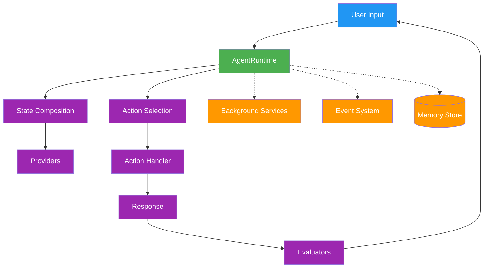
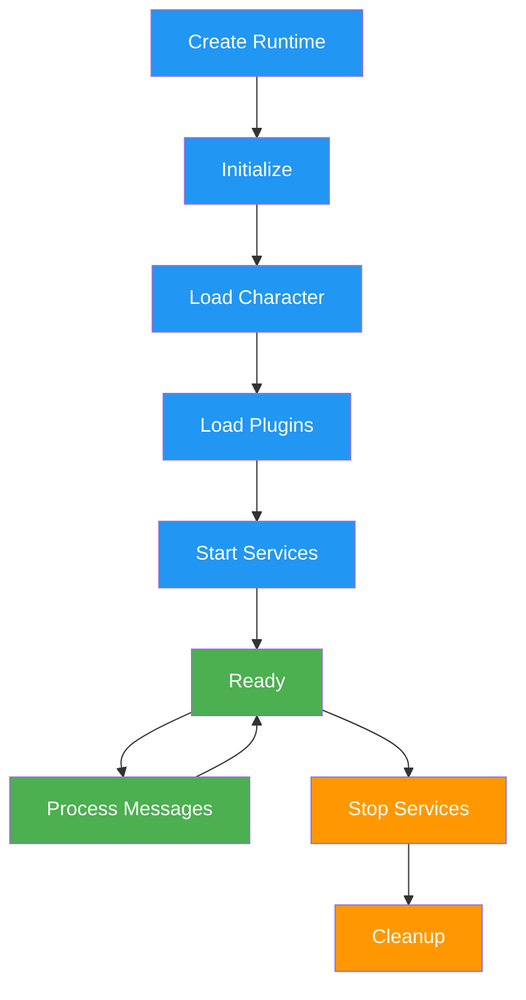
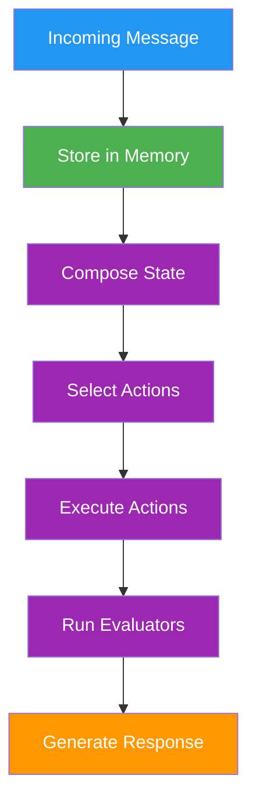

# Core

> Core runtime system, lifecycle, and architecture

## System Architecture

The elizaOS runtime follows a modular, plugin-based architecture that orchestrates all agent functionality. For lifecycle details, see [Runtime and Lifecycle](/agents/runtime-and-lifecycle). For extension architecture, see [Plugin Architecture](/plugins/architecture).



### Core Components

The runtime orchestrates these essential components:

- **AgentRuntime**: Central orchestrator managing agent lifecycle
- **Plugin System**: Extends functionality through modular components
- **Memory System**: Hierarchical storage for conversations and knowledge
- **State Management**: Aggregates context from multiple sources
- **Service Layer**: Background processes and integrations

For related documentation, see [Plugin Architecture](/plugins/architecture), [Memory](/runtime/memory), and [Services](/runtime/services).

## AgentRuntime Class

The `AgentRuntime` class is the central engine that manages agent lifecycle, processes messages, and coordinates all system components.

### Core Interface

```typescript theme={null}
interface IAgentRuntime extends IDatabaseAdapter {
  // Core properties
  agentId: UUID;
  character: Character;
  providers: Provider[];
  actions: Action[];
  evaluators: Evaluator[];
  services: Service[];

  // Action processing
  processActions(
    message: Memory,
    responses: Memory[],
    state?: State
  ): Promise<void>;
  composeState(message: Memory, state?: State): Promise<State>;
  evaluate(message: Memory, state?: State): Promise<void>;

  // Component registration
  registerAction(action: Action): void;
  registerProvider(provider: Provider): void;
  registerEvaluator(evaluator: Evaluator): void;
  registerService(service: Service): void;

  // Service management
  getService<T>(name: ServiceType): T;
  stop(): Promise<void>;

  // Model management
  useModel<T extends ModelTypeName>(
    modelType: T,
    params: ModelParamsMap[T],
    provider?: string
  ): Promise<ModelResultMap[T]>;
  registerModel(
    modelType: ModelTypeName,
    handler: ModelHandler,
    provider?: string,
    priority?: number
  ): void;
  getModel(
    modelType: ModelTypeName,
    provider?: string
  ): ModelHandler | undefined;

  // Event system
  emit(eventType: EventType, data: any): Promise<void>;
  on(eventType: EventType, handler: EventHandler): void;
}
```

### Key Responsibilities

#### 1. Action Processing

The runtime orchestrates action selection and execution:

```typescript theme={null}
async processActions(message: Memory, responses: Memory[], state?: State): Promise<void> {
  // Select and execute actions based on context
  const actions = await this.selectActions(message, state);

  for (const action of actions) {
    await action.handler(this, message, state);
  }

  // Run evaluators on results
  await this.evaluate(message, state);
}
```

#### 2. State Composition

Builds comprehensive context by aggregating data from providers:

```typescript theme={null}
async composeState(message: Memory): Promise<State> {
  const state = {};

  for (const provider of this.providers) {
    const data = await provider.get(this, message, state);
    Object.assign(state, data);
  }

  return state;
}
```

#### 3. Plugin Management

Registers and initializes plugin components:

```typescript theme={null}
async registerPlugin(plugin: Plugin) {
  // Register components
  plugin.actions?.forEach(a => this.registerAction(a));
  plugin.providers?.forEach(p => this.registerProvider(p));
  plugin.evaluators?.forEach(e => this.registerEvaluator(e));
  plugin.services?.forEach(s => this.registerService(s));

  // Initialize plugin
  await plugin.init?.(this.config, this);
}
```

## Runtime Lifecycle



### Initialization Sequence

1. **Runtime Creation**: Instantiate with character and configuration
2. **Character Loading**: Load agent personality and settings
3. **Plugin Loading**: Register plugins in dependency order
4. **Service Startup**: Initialize background services
5. **Ready State**: Agent ready to process messages

### Plugin Loading Order

```typescript theme={null}
// Plugin priority determines load order
const pluginLoadOrder = [
  databases, // Priority: -100
  modelProviders, // Priority: -50
  corePlugins, // Priority: 0
  features, // Priority: 50
  platforms, // Priority: 100
];
```

## Configuration

### Runtime Configuration

The runtime accepts configuration through multiple sources:

```typescript theme={null}
interface RuntimeConfig {
  character: Character;
  plugins: Plugin[];
  database?: DatabaseConfig;
  models?: ModelConfig;
  services?: ServiceConfig;
  environment?: EnvironmentConfig;
}
```

### Environment Variables

Core runtime environment variables:

- `NODE_ENV` - Runtime environment (development/production)
- `LOG_LEVEL` - Logging verbosity
- `DATABASE_URL` - Database connection string
- `API_PORT` - Server port for API endpoints
- `AGENT_ID` - Unique agent identifier

### Settings Management

Access configuration through the runtime:

```typescript theme={null}
// Get setting with fallback
const apiKey = runtime.getSetting("API_KEY");

// Check if setting exists
if (runtime.hasSetting("FEATURE_FLAG")) {
  // Feature is enabled
}
```

## Database Abstraction

The runtime implements `IDatabaseAdapter` for data persistence:

```typescript theme={null}
interface IDatabaseAdapter {
  // Memory operations
  createMemory(memory: Memory): Promise<void>;
  searchMemories(query: string, limit?: number): Promise<Memory[]>;
  getMemoryById(id: UUID): Promise<Memory | null>;

  // Entity management
  createEntity(entity: Entity): Promise<void>;
  updateEntity(entity: Entity): Promise<void>;
  getEntity(id: UUID): Promise<Entity | null>;

  // Relationships
  createRelationship(rel: Relationship): Promise<void>;
  getRelationships(entityId: UUID): Promise<Relationship[]>;

  // Facts and knowledge
  createFact(fact: Fact): Promise<void>;
  searchFacts(query: string): Promise<Fact[]>;
}
```

### Memory Operations

```typescript theme={null}
// Store a message
await runtime.createMemory({
  type: MemoryType.MESSAGE,
  content: { text: "User message" },
  roomId: message.roomId,
  userId: message.userId,
});

// Search memories
const memories = await runtime.searchMemories(
  "previous conversation",
  10 // limit
);

// Get specific memory
const memory = await runtime.getMemoryById(memoryId);
```

## Message Processing Pipeline

The runtime processes messages through a defined pipeline:



### Processing Steps

1. **Message Receipt**: Receive and validate incoming message
2. **Memory Storage**: Persist message to database
3. **State Composition**: Build context from providers
4. **Action Selection**: Choose appropriate actions
5. **Action Execution**: Run selected action handlers
6. **Evaluation**: Post-process results
7. **Response Generation**: Create and send response

## Error Handling

The runtime implements comprehensive error handling:

```typescript theme={null}
try {
  await runtime.processActions(message, responses, state);
} catch (error) {
  if (error instanceof ActionError) {
    // Handle action-specific errors
    runtime.logger.error("Action failed:", error);
  } else if (error instanceof StateError) {
    // Handle state composition errors
    runtime.logger.error("State error:", error);
  } else {
    // Handle unexpected errors
    runtime.logger.error("Unexpected error:", error);
    // Optionally trigger recovery
  }
}
```

## Performance Considerations

### State Caching

The runtime caches composed state for performance:

```typescript theme={null}
// State is cached by message ID
const state = await runtime.composeState(message);
// Subsequent calls use cache
const cachedState = await runtime.composeState(message);
```

### Service Pooling

Services are singleton instances shared across the runtime:

```typescript theme={null}
// Services are created once and reused
const service = runtime.getService(ServiceType.DATABASE);
// Same instance returned
const sameService = runtime.getService(ServiceType.DATABASE);
```

## Best Practices

### Runtime Initialization

- Initialize plugins in dependency order
- Start services after all plugins are loaded
- Verify character configuration before starting
- Set up error handlers before processing

### Resource Management

- Clean up services on shutdown
- Clear state cache periodically
- Monitor memory usage
- Implement connection pooling

### Error Recovery

- Implement retry logic for transient failures
- Log errors with context
- Gracefully degrade functionality
- Maintain audit trail

## Integration Points

The runtime provides multiple integration points:

- **Plugins**: Extend functionality through the plugin system
- **Events**: React to runtime events
- **Services**: Add background processes
- **Models**: Integrate AI providers
- **Database**: Custom database adapters
- **API**: HTTP endpoints through routes

## See Also

<CardGroup cols={2}>
  <Card title="Memory System" icon="brain" href="/runtime/memory">
    Learn about the fundamental storage layer
  </Card>

  <Card title="Events" icon="bolt" href="/runtime/events">
    Understand the communication backbone
  </Card>

  <Card title="Providers" icon="database" href="/runtime/providers">
    Explore how to supply data to the runtime
  </Card>

  <Card title="Models" icon="robot" href="/runtime/models">
    Discover AI model management
  </Card>
</CardGroup>

---

> To find navigation and other pages in this documentation, fetch the llms.txt file at: https://docs.elizaos.ai/llms.txt
