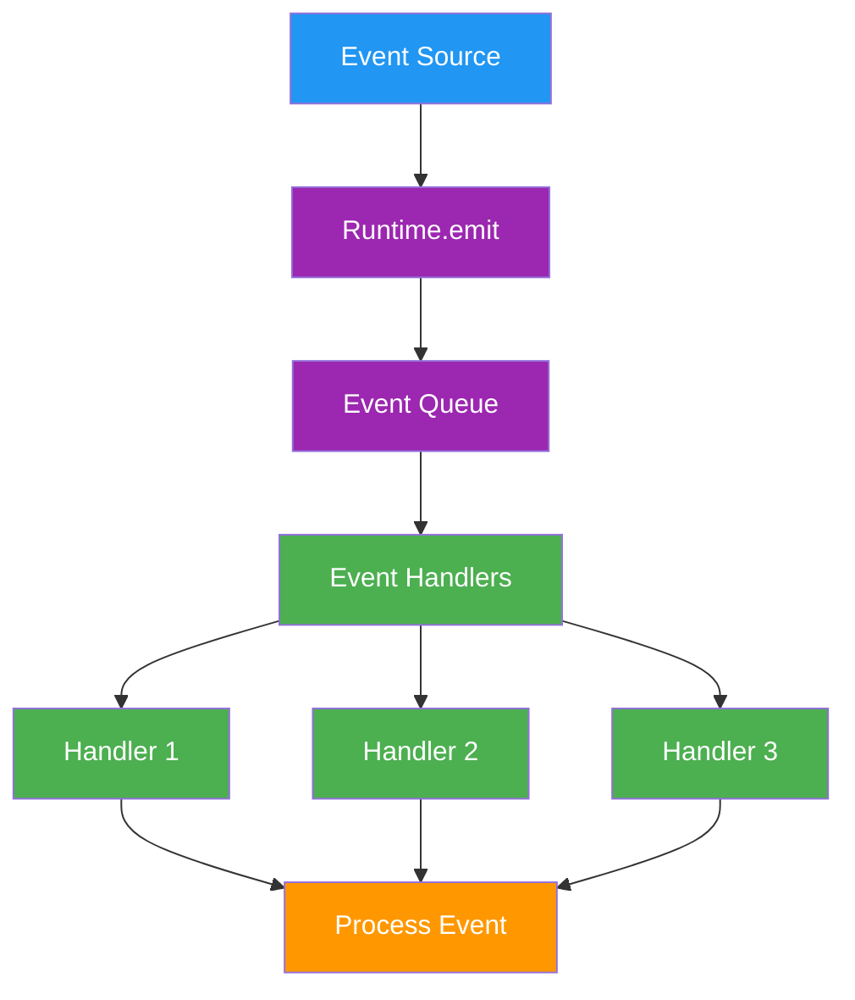

# Events

> Event system, event types, and event handling patterns

## Event System

The event system enables reactive programming patterns, allowing plugins and services to respond to runtime activities. Events flow through the system providing hooks for custom logic and integrations.

## Event Architecture



## Event Types

### Core Event Types

```typescript theme={null}
enum EventType {
  // World events
  WORLD_JOINED = "world:joined",
  WORLD_CONNECTED = "world:connected",
  WORLD_LEFT = "world:left",

  // Entity events
  ENTITY_JOINED = "entity:joined",
  ENTITY_LEFT = "entity:left",
  ENTITY_UPDATED = "entity:updated",

  // Room events
  ROOM_JOINED = "room:joined",
  ROOM_LEFT = "room:left",
  ROOM_UPDATED = "room:updated",

  // Message events
  MESSAGE_RECEIVED = "message:received",
  MESSAGE_SENT = "message:sent",
  MESSAGE_DELETED = "message:deleted",
  MESSAGE_UPDATED = "message:updated",

  // Voice events
  VOICE_MESSAGE_RECEIVED = "voice:message:received",
  VOICE_MESSAGE_SENT = "voice:message:sent",
  VOICE_STARTED = "voice:started",
  VOICE_ENDED = "voice:ended",

  // Run events
  RUN_STARTED = "run:started",
  RUN_COMPLETED = "run:completed",
  RUN_FAILED = "run:failed",
  RUN_TIMEOUT = "run:timeout",

  // Action events
  ACTION_STARTED = "action:started",
  ACTION_COMPLETED = "action:completed",
  ACTION_FAILED = "action:failed",

  // Evaluator events
  EVALUATOR_STARTED = "evaluator:started",
  EVALUATOR_COMPLETED = "evaluator:completed",
  EVALUATOR_FAILED = "evaluator:failed",

  // Model events
  MODEL_USED = "model:used",
  MODEL_FAILED = "model:failed",

  // Service events
  SERVICE_STARTED = "service:started",
  SERVICE_STOPPED = "service:stopped",
  SERVICE_ERROR = "service:error",
}
```

## Event Payloads

### Payload Interfaces

Each event type has a specific payload structure:

```typescript theme={null}
// Message event payload
interface MessagePayload {
  runtime: IAgentRuntime;
  message: Memory;
  room?: Room;
  user?: User;
  callback?: ResponseCallback;
}

// World event payload
interface WorldPayload {
  runtime: IAgentRuntime;
  world: World;
  metadata?: Record<string, any>;
}

// Entity event payload
interface EntityPayload {
  runtime: IAgentRuntime;
  entity: Entity;
  action: "joined" | "left" | "updated";
  changes?: Partial<Entity>;
}

// Action event payload
interface ActionPayload {
  runtime: IAgentRuntime;
  action: Action;
  message: Memory;
  state: State;
  result?: any;
  error?: Error;
}

// Model event payload
interface ModelPayload {
  runtime: IAgentRuntime;
  modelType: ModelTypeName;
  provider: string;
  params: any;
  result?: any;
  error?: Error;
  duration: number;
}
```

## Event Handlers

### Handler Registration

Event handlers are registered during plugin initialization:

```typescript theme={null}
const myPlugin: Plugin = {
  name: "my-plugin",
  events: {
    [EventType.MESSAGE_RECEIVED]: [handleMessageReceived, logMessage],
    [EventType.ACTION_COMPLETED]: [processActionResult],
    [EventType.RUN_COMPLETED]: [cleanupRun],
  },
};
```

### Handler Implementation

```typescript theme={null}
// Message handler
async function handleMessageReceived(payload: MessagePayload) {
  const { runtime, message, room, user, callback } = payload;

  // Process the message
  const state = await runtime.composeState(message);

  // Check if we should respond
  if (shouldRespond(message, state)) {
    await runtime.processActions(message, [], state);
  }

  // Call callback if provided
  if (callback) {
    await callback({
      text: "Message processed",
      metadata: { processed: true },
    });
  }
}

// Action handler
async function processActionResult(payload: ActionPayload) {
  const { runtime, action, result, error } = payload;

  if (error) {
    runtime.logger.error(`Action ${action.name} failed:`, error);
    // Handle error
    return;
  }

  // Process successful result
  runtime.logger.info(`Action ${action.name} completed:`, result);

  // Store result in memory
  await runtime.createMemory({
    type: MemoryType.ACTION,
    content: {
      text: `Action ${action.name} completed`,
      action: action.name,
      result,
    },
    roomId: payload.message.roomId,
  });
}
```

## Event Emission

### Emitting Events

```typescript theme={null}
// Emit an event from the runtime
await runtime.emit(EventType.MESSAGE_RECEIVED, {
  runtime,
  message,
  room,
  user,
  callback,
});

// Emit from a service
class CustomService extends Service {
  async processData(data: any) {
    await this.runtime.emit(EventType.CUSTOM_EVENT, {
      runtime: this.runtime,
      data,
      timestamp: Date.now(),
    });
  }
}

// Emit from an action
const customAction: Action = {
  name: "CUSTOM_ACTION",
  handler: async (runtime, message, state) => {
    // Do work
    const result = await performAction();

    // Emit completion event
    await runtime.emit(EventType.ACTION_COMPLETED, {
      runtime,
      action: customAction,
      message,
      state,
      result,
    });

    return result;
  },
};
```

## Event Listeners

### Adding Event Listeners

```typescript theme={null}
// Add listener to runtime
runtime.on(EventType.MESSAGE_RECEIVED, async (payload) => {
  console.log("Message received:", payload.message.content.text);
});

// Add multiple listeners
runtime.on(EventType.ACTION_STARTED, logActionStart);
runtime.on(EventType.ACTION_STARTED, trackActionMetrics);
runtime.on(EventType.ACTION_STARTED, notifyActionStart);

// One-time listener
runtime.once(EventType.SERVICE_STARTED, async (payload) => {
  console.log("Service started:", payload.service.name);
});
```

### Removing Event Listeners

```typescript theme={null}
// Remove specific listener
runtime.off(EventType.MESSAGE_RECEIVED, messageHandler);

// Remove all listeners for an event
runtime.removeAllListeners(EventType.MESSAGE_RECEIVED);

// Remove all listeners
runtime.removeAllListeners();
```

## Event Patterns

### Request-Response Pattern

```typescript theme={null}
// Emit event and wait for response
async function requestWithResponse(runtime: IAgentRuntime, data: any) {
  return new Promise((resolve, reject) => {
    const timeout = setTimeout(() => {
      reject(new Error("Response timeout"));
    }, 5000);

    // Listen for response
    runtime.once(EventType.RESPONSE_RECEIVED, (payload) => {
      clearTimeout(timeout);
      resolve(payload.response);
    });

    // Emit request
    runtime.emit(EventType.REQUEST_SENT, {
      runtime,
      data,
      requestId: generateId(),
    });
  });
}
```

### Event Chaining

```typescript theme={null}
// Chain events for complex workflows
const workflowPlugin: Plugin = {
  name: "workflow",
  events: {
    [EventType.MESSAGE_RECEIVED]: [
      async (payload) => {
        // Step 1: Process message
        const processed = await processMessage(payload);

        // Emit next event
        await payload.runtime.emit(EventType.MESSAGE_PROCESSED, {
          ...payload,
          processed,
        });
      },
    ],

    [EventType.MESSAGE_PROCESSED]: [
      async (payload) => {
        // Step 2: Generate response
        const response = await generateResponse(payload);

        // Emit next event
        await payload.runtime.emit(EventType.RESPONSE_GENERATED, {
          ...payload,
          response,
        });
      },
    ],

    [EventType.RESPONSE_GENERATED]: [
      async (payload) => {
        // Step 3: Send response
        await sendResponse(payload);
      },
    ],
  },
};
```

### Event Aggregation

```typescript theme={null}
// Aggregate multiple events
class EventAggregator {
  private events: Map<string, any[]> = new Map();
  private flushInterval: NodeJS.Timer;

  constructor(private runtime: IAgentRuntime) {
    // Listen for events to aggregate
    runtime.on(EventType.MODEL_USED, this.aggregate.bind(this));

    // Flush periodically
    this.flushInterval = setInterval(() => this.flush(), 60000);
  }

  private aggregate(payload: ModelPayload) {
    const key = `${payload.modelType}:${payload.provider}`;

    if (!this.events.has(key)) {
      this.events.set(key, []);
    }

    this.events.get(key).push({
      timestamp: Date.now(),
      duration: payload.duration,
      params: payload.params,
    });
  }

  private async flush() {
    for (const [key, events] of this.events.entries()) {
      const [modelType, provider] = key.split(":");

      // Calculate metrics
      const metrics = {
        count: events.length,
        avgDuration:
          events.reduce((sum, e) => sum + e.duration, 0) / events.length,
        totalDuration: events.reduce((sum, e) => sum + e.duration, 0),
      };

      // Emit aggregated event
      await this.runtime.emit(EventType.METRICS_AGGREGATED, {
        runtime: this.runtime,
        modelType,
        provider,
        metrics,
        period: 60000,
      });
    }

    // Clear events
    this.events.clear();
  }

  stop() {
    clearInterval(this.flushInterval);
  }
}
```

## Custom Events

### Defining Custom Events

```typescript theme={null}
// Extend EventType with custom events
declare module "@elizaos/core" {
  interface EventTypeRegistry {
    CUSTOM_DATA_RECEIVED: "custom:data:received";
    CUSTOM_PROCESS_COMPLETE: "custom:process:complete";
    CUSTOM_ERROR_OCCURRED: "custom:error:occurred";
  }
}

// Define custom payload
interface CustomDataPayload {
  runtime: IAgentRuntime;
  data: any;
  source: string;
  timestamp: number;
}
```

### Using Custom Events

```typescript theme={null}
const customPlugin: Plugin = {
  name: "custom-plugin",

  events: {
    "custom:data:received": [
      async (payload: CustomDataPayload) => {
        // Process custom data
        const processed = await processCustomData(payload.data);

        // Emit completion
        await payload.runtime.emit("custom:process:complete", {
          runtime: payload.runtime,
          original: payload.data,
          processed,
          duration: Date.now() - payload.timestamp,
        });
      },
    ],
  },

  actions: [
    {
      name: "RECEIVE_DATA",
      handler: async (runtime, message, state) => {
        // Emit custom event
        await runtime.emit("custom:data:received", {
          runtime,
          data: message.content,
          source: "user",
          timestamp: Date.now(),
        });
      },
    },
  ],
};
```

## Event Middleware

### Creating Event Middleware

```typescript theme={null}
// Middleware to log all events
function loggingMiddleware(eventType: EventType, payload: any) {
  console.log(`[Event] ${eventType}:`, {
    timestamp: new Date().toISOString(),
    type: eventType,
    payload: JSON.stringify(payload).slice(0, 200),
  });
}

// Middleware to filter events
function filterMiddleware(allowedEvents: EventType[]) {
  return (eventType: EventType, payload: any, next: Function) => {
    if (allowedEvents.includes(eventType)) {
      next(payload);
    }
  };
}

// Middleware to transform payload
function transformMiddleware(
  eventType: EventType,
  payload: any,
  next: Function
) {
  const transformed = {
    ...payload,
    timestamp: Date.now(),
    eventType,
  };
  next(transformed);
}
```

## Error Handling

### Event Error Handling

```typescript theme={null}
// Global error handler for events
runtime.on("error", (error: Error, eventType: EventType, payload: any) => {
  console.error(`Error in event ${eventType}:`, error);

  // Log to monitoring service
  monitoringService.logError({
    error: error.message,
    stack: error.stack,
    eventType,
    payload: JSON.stringify(payload).slice(0, 1000),
  });
});

// Handler with error handling
async function safeEventHandler(payload: any) {
  try {
    await riskyOperation(payload);
  } catch (error) {
    // Emit error event
    await payload.runtime.emit(EventType.SERVICE_ERROR, {
      runtime: payload.runtime,
      error,
      originalEvent: payload,
    });

    // Don't throw - allow other handlers to run
  }
}
```

## Performance Considerations

### Event Batching

```typescript theme={null}
class EventBatcher {
  private batch: Map<EventType, any[]> = new Map();
  private batchSize = 100;
  private flushInterval = 1000;
  private timer: NodeJS.Timer;

  constructor(private runtime: IAgentRuntime) {
    this.timer = setInterval(() => this.flush(), this.flushInterval);
  }

  add(eventType: EventType, payload: any) {
    if (!this.batch.has(eventType)) {
      this.batch.set(eventType, []);
    }

    const events = this.batch.get(eventType);
    events.push(payload);

    if (events.length >= this.batchSize) {
      this.flushType(eventType);
    }
  }

  private flushType(eventType: EventType) {
    const events = this.batch.get(eventType);
    if (!events || events.length === 0) return;

    // Emit batch event
    this.runtime.emit(`${eventType}:batch` as EventType, {
      runtime: this.runtime,
      events,
      count: events.length,
    });

    this.batch.set(eventType, []);
  }

  flush() {
    for (const eventType of this.batch.keys()) {
      this.flushType(eventType);
    }
  }

  stop() {
    clearInterval(this.timer);
    this.flush();
  }
}
```

### Event Throttling

```typescript theme={null}
// Throttle high-frequency events
function throttleEvents(eventType: EventType, delay: number) {
  let lastEmit = 0;
  let pending: any = null;
  let timer: NodeJS.Timeout;

  return (payload: any) => {
    const now = Date.now();

    if (now - lastEmit >= delay) {
      // Emit immediately
      runtime.emit(eventType, payload);
      lastEmit = now;
    } else {
      // Store for later
      pending = payload;

      // Schedule emit
      if (!timer) {
        timer = setTimeout(
          () => {
            if (pending) {
              runtime.emit(eventType, pending);
              lastEmit = Date.now();
              pending = null;
            }
            timer = null;
          },
          delay - (now - lastEmit)
        );
      }
    }
  };
}
```

## Best Practices

### Event Design

- **Specific Events**: Create specific events rather than generic ones
- **Consistent Payloads**: Use consistent payload structures
- **Event Naming**: Use clear, hierarchical naming (domain:action:status)
- **Documentation**: Document event types and payloads
- **Versioning**: Version events when making breaking changes

### Performance

- **Async Handlers**: Always use async handlers
- **Non-Blocking**: Don't block the event loop
- **Batching**: Batch high-frequency events
- **Throttling**: Throttle rapid events
- **Cleanup**: Remove unused listeners

### Error Handling

- **Graceful Failures**: Don't crash on handler errors
- **Error Events**: Emit error events for monitoring
- **Timeouts**: Set timeouts for long operations
- **Retries**: Implement retry logic for transient failures
- **Logging**: Log errors with context

## See Also

<CardGroup cols={2}>
  <Card title="Providers" icon="database" href="/runtime/providers">
    Learn how providers use events
  </Card>

  <Card title="Models" icon="robot" href="/runtime/models">
    Explore AI model management
  </Card>

  <Card title="Services" icon="server" href="/runtime/services">
    Build services that emit and handle events
  </Card>

  <Card title="Messaging" icon="message" href="/runtime/messaging">
    Understand real-time event streaming
  </Card>
</CardGroup>

---

> To find navigation and other pages in this documentation, fetch the llms.txt file at: https://docs.elizaos.ai/llms.txt
