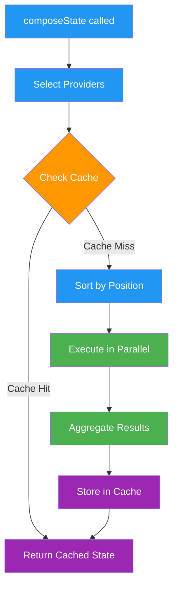

# Providers

> Provider system for context aggregation and state composition

## Provider Interface

Providers supply contextual information that forms the agent's understanding of the current situation. They are the "senses" of the agent, gathering data from various sources to build comprehensive state.

### Core Interface

```typescript theme={null}
interface Provider {
  name: string;
  description: string;
  dynamic?: boolean; // Only executed when explicitly requested
  private?: boolean; // Internal-only, not included in default state
  position?: number; // Execution order (lower runs first)

  get: (
    runtime: IAgentRuntime,
    message: Memory,
    state?: State
  ) => Promise<ProviderResult>;
}

interface ProviderResult {
  values: Record<string, any>; // Key-value pairs for templates
  data: Record<string, any>; // Structured data
  text: string; // Textual context
}
```

### Provider Types

- **Standard Providers**: Included by default in state composition
- **Dynamic Providers**: Only executed when explicitly requested
- **Private Providers**: Internal use only, not exposed in default state

## Built-in Providers

### Provider Summary Table

| Provider Name       | Dynamic | Position | Default Included | Purpose                    |
| ------------------- | ------- | -------- | ---------------- | -------------------------- |
| **ACTIONS**         | No      | -1       | Yes              | Lists available actions    |
| **ACTION_STATE**    | No      | 150      | Yes              | Action execution state     |
| **ANXIETY**         | No      | Default  | Yes              | Response style guidelines  |
| **ATTACHMENTS**     | Yes     | Default  | No               | File/media attachments     |
| **CAPABILITIES**    | No      | Default  | Yes              | Service capabilities       |
| **CHARACTER**       | No      | Default  | Yes              | Agent personality          |
| **CHOICE**          | No      | Default  | Yes              | Pending user choices       |
| **ENTITIES**        | Yes     | Default  | No               | Conversation participants  |
| **EVALUATORS**      | No      | Default  | No (private)     | Post-processing options    |
| **FACTS**           | Yes     | Default  | No               | Stored knowledge           |
| **PROVIDERS**       | No      | Default  | Yes              | Available providers list   |
| **RECENT_MESSAGES** | No      | 100      | Yes              | Conversation history       |
| **RELATIONSHIPS**   | Yes     | Default  | No               | Social connections         |
| **ROLES**           | No      | Default  | Yes              | Server roles (groups only) |
| **SETTINGS**        | No      | Default  | Yes              | Configuration state        |
| **TIME**            | No      | Default  | Yes              | Current UTC time           |
| **WORLD**           | Yes     | Default  | No               | Server/world context       |

### Provider Details

#### Actions Provider (`ACTIONS`)

Lists all available actions the agent can execute.

- **Position**: -1 (runs early)
- **Dynamic**: No (included by default)
- **Data Provided**:
  - `actionNames`: Comma-separated list of action names
  - `actionsWithDescriptions`: Formatted action details
  - `actionExamples`: Example usage for each action
  - `actionsData`: Raw action objects

```typescript theme={null}
{
  values: {
    actionNames: "Possible response actions: 'SEND_MESSAGE', 'SEARCH', 'CALCULATE'",
    actionExamples: "..."
  },
  data: { actionsData: [...] },
  text: "# Available Actions\n..."
}
```

#### Action State Provider (`ACTION_STATE`)

Shares execution state between chained actions.

- **Position**: 150 (runs later)
- **Dynamic**: No (included by default)
- **Data Provided**:
  - `actionResults`: Previous action execution results
  - `actionPlan`: Multi-step action execution plan
  - `workingMemory`: Temporary data shared between actions
  - `recentActionMemories`: Historical action executions

#### Character Provider (`CHARACTER`)

Core personality and behavior definition.

- **Dynamic**: No (included by default)
- **Data Provided**:
  - `agentName`: Character name
  - `bio`: Character background
  - `topics`: Current interests
  - `adjective`: Current mood/state
  - `directions`: Style guidelines
  - `examples`: Example conversations/posts

```typescript theme={null}
{
  values: {
    agentName: "Alice",
    bio: "AI assistant focused on...",
    topics: "technology, science, education",
    adjective: "helpful"
  },
  data: { character: {...} },
  text: "# About Alice\n..."
}
```

#### Recent Messages Provider (`RECENT_MESSAGES`)

Provides conversation history and context.

- **Position**: 100 (runs later to access other data)
- **Dynamic**: No (included by default)
- **Data Provided**:
  - `recentMessages`: Formatted conversation history
  - `recentInteractions`: Previous interactions
  - `actionResults`: Results from recent actions

```typescript theme={null}
{
  values: {
    recentMessages: "User: Hello\nAlice: Hi there!",
    recentInteractions: "..."
  },
  data: {
    recentMessages: [...],
    actionResults: [...]
  },
  text: "# Conversation Messages\n..."
}
```

#### Facts Provider (`FACTS`)

Retrieves contextually relevant stored facts.

- **Dynamic**: Yes (must be explicitly included)
- **Behavior**: Uses embedding search to find relevant facts
- **Data Provided**:
  - Relevant facts based on context
  - Fact metadata and sources

#### Relationships Provider (`RELATIONSHIPS`)

Social graph and interaction history.

- **Dynamic**: Yes (must be explicitly included)
- **Data Provided**:
  - Known entities and their relationships
  - Interaction frequency
  - Relationship metadata

## State Composition

The `composeState` method aggregates data from multiple providers to create comprehensive state.

### Method Signature

```typescript theme={null}
async composeState(
    message: Memory,
    includeList: string[] | null = null,
    onlyInclude = false,
    skipCache = false
): Promise<State>
```

### Parameters

- **message**: The current message/memory object being processed
- **includeList**: Array of provider names to include (optional)
- **onlyInclude**: If true, ONLY include providers from includeList
- **skipCache**: If true, bypass cache and fetch fresh data

### Composition Process

1. **Provider Selection**: Determines which providers to run based on filters
2. **Parallel Execution**: Runs all selected providers concurrently
3. **Result Aggregation**: Combines results from all providers
4. **Caching**: Stores the composed state for reuse

### Usage Patterns

```typescript theme={null}
// Default state (all non-dynamic, non-private providers)
const state = await runtime.composeState(message);

// Include specific dynamic providers
const state = await runtime.composeState(message, ["FACTS", "ENTITIES"]);

// Only specific providers
const state = await runtime.composeState(message, ["CHARACTER"], true);

// Force fresh data (skip cache)
const state = await runtime.composeState(message, null, false, true);
```

## Provider Registration

### Registering a Provider

```typescript theme={null}
runtime.registerProvider(provider);
```

Providers are registered during plugin initialization:

```typescript theme={null}
const myPlugin: Plugin = {
  name: "my-plugin",
  providers: [customProvider],

  init: async (config, runtime) => {
    // Providers auto-registered
  },
};
```

### Provider Position

Position determines execution order:

```typescript theme={null}
const earlyProvider: Provider = {
  name: 'EARLY',
  position: -100,  // Runs very early
  get: async () => {...}
};

const lateProvider: Provider = {
  name: 'LATE',
  position: 200,   // Runs late
  get: async () => {...}
};
```

## Custom Providers

### Creating a Custom Provider

```typescript theme={null}
const customDataProvider: Provider = {
  name: "CUSTOM_DATA",
  description: "Custom data from external source",
  dynamic: true,
  position: 150,

  get: async (runtime, message, state) => {
    try {
      // Fetch data from service or database
      const customData = await runtime.getService("customService")?.getData();

      if (!customData) {
        return { values: {}, data: {}, text: "" };
      }

      return {
        values: { customData: customData.summary },
        data: { customData },
        text: `Custom data: ${customData.summary}`,
      };
    } catch (error) {
      runtime.logger.error("Error in custom provider:", error);
      return { values: {}, data: {}, text: "" };
    }
  },
};
```

### Provider Best Practices

1. **Return quickly**: Use timeouts for external calls
2. **Handle errors gracefully**: Return empty result on failure
3. **Keep data size reasonable**: Don't return excessive data
4. **Use appropriate flags**: Set `dynamic` for optional providers
5. **Consider position**: Order matters for dependent providers

### Provider Dependencies

Providers can access data from previously executed providers through the state parameter:

```typescript theme={null}
const dependentProvider: Provider = {
  name: "DEPENDENT",
  position: 200, // Runs after other providers

  get: async (runtime, message, state) => {
    // Access data from earlier providers
    const characterData = state?.data?.providers?.CHARACTER?.data;

    if (!characterData) {
      return { values: {}, data: {}, text: "" };
    }

    // Process based on character data
    const processed = processCharacterData(characterData);

    return {
      values: { processed: processed.summary },
      data: { processed },
      text: `Processed: ${processed.summary}`,
    };
  },
};
```

## State Cache Management

### Cache Architecture

The runtime maintains an in-memory cache of composed states:

```typescript theme={null}
// Cache is stored by message ID
this.stateCache.set(message.id, newState);
```

### Cache Usage

```typescript theme={null}
// Use cached data (default behavior)
const cachedState = await runtime.composeState(message);

// Force fresh data
const freshState = await runtime.composeState(message, null, false, true);
```

### Cache Optimization

```typescript theme={null}
// Clear old cache entries periodically
setInterval(() => {
  const fiveMinutesAgo = Date.now() - 5 * 60 * 1000;
  for (const [messageId, _] of runtime.stateCache.entries()) {
    runtime.getMemoryById(messageId).then((memory) => {
      if (memory && memory.createdAt < fiveMinutesAgo) {
        runtime.stateCache.delete(messageId);
      }
    });
  }
}, 60000); // Run every minute
```

## Provider Execution Flow



## Performance Optimization

### Parallel Execution

Providers run concurrently for optimal performance:

```typescript theme={null}
const results = await Promise.all(
  providers.map((provider) => provider.get(runtime, message, partialState))
);
```

### Timeout Handling

Implement timeouts to prevent slow providers from blocking:

```typescript theme={null}
const timeoutProvider: Provider = {
  name: "TIMEOUT_SAFE",
  get: async (runtime, message) => {
    const fetchData = async () => {
      // Potentially slow operation
      const data = await externalAPI.fetch();
      return formatProviderResult(data);
    };

    return Promise.race([
      fetchData(),
      new Promise((_, reject) =>
        setTimeout(() => reject(new Error("Timeout")), 5000)
      ),
    ]).catch((error) => {
      runtime.logger.warn(`Provider timeout: ${error.message}`);
      return { values: {}, data: {}, text: "" };
    });
  },
};
```

## Common Issues and Solutions

### Circular Dependencies

Avoid providers that depend on each other circularly:

```typescript theme={null}
// BAD: Circular dependency
const providerA: Provider = {
  get: async (runtime, message) => {
    const state = await runtime.composeState(message, ["B"]);
    // Uses B's data
  },
};

const providerB: Provider = {
  get: async (runtime, message) => {
    const state = await runtime.composeState(message, ["A"]);
    // Uses A's data - CIRCULAR!
  },
};

// GOOD: Use position and state parameter
const providerA: Provider = {
  position: 100,
  get: async (runtime, message) => {
    // Generate data independently
    return { data: { aData: "value" } };
  },
};

const providerB: Provider = {
  position: 200,
  get: async (runtime, message, state) => {
    // Access A's data from state
    const aData = state?.data?.providers?.A?.data;
    return { data: { bData: processData(aData) } };
  },
};
```

### Memory Leaks

Prevent memory leaks with proper cache management:

```typescript theme={null}
class BoundedCache extends Map {
  private maxSize: number;

  constructor(maxSize: number = 1000) {
    super();
    this.maxSize = maxSize;
  }

  set(key: string, value: any) {
    if (this.size >= this.maxSize) {
      const firstKey = this.keys().next().value;
      this.delete(firstKey);
    }
    return super.set(key, value);
  }
}
```

### Debugging State Composition

```typescript theme={null}
// Debug helper to trace provider execution
async function debugComposeState(
  runtime: IAgentRuntime,
  message: Memory,
  includeList?: string[]
) {
  console.log("=== State Composition Debug ===");
  console.log("Message ID:", message.id);
  console.log("Include List:", includeList || "default");

  // Monkey patch provider execution
  const originalProviders = runtime.providers;
  runtime.providers = runtime.providers.map((provider) => ({
    ...provider,
    get: async (...args) => {
      const start = Date.now();
      console.log(`[${provider.name}] Starting...`);

      try {
        const result = await provider.get(...args);
        const duration = Date.now() - start;
        console.log(`[${provider.name}] Completed in ${duration}ms`);
        console.log(
          `[${provider.name}] Data size:`,
          JSON.stringify(result).length
        );
        return result;
      } catch (error) {
        console.error(`[${provider.name}] Error:`, error);
        throw error;
      }
    },
  }));

  const state = await runtime.composeState(message, includeList);

  // Restore original providers
  runtime.providers = originalProviders;

  console.log("=== Final State Summary ===");
  console.log(
    "Total providers run:",
    Object.keys(state.data.providers || {}).length
  );
  console.log("State text length:", state.text.length);
  console.log("===============================");

  return state;
}
```

## See Also

<CardGroup cols={2}>
  <Card title="Models" icon="robot" href="/runtime/models">
    Learn how models use provider context
  </Card>

  <Card title="Services" icon="server" href="/runtime/services">
    Build services that use providers
  </Card>

  <Card title="Messaging" icon="message" href="/runtime/messaging">
    Real-time provider updates
  </Card>

  <Card title="Sessions API" icon="comments" href="/runtime/sessions-api">
    See providers in conversational context
  </Card>
</CardGroup>

---

> To find navigation and other pages in this documentation, fetch the llms.txt file at: https://docs.elizaos.ai/llms.txt
