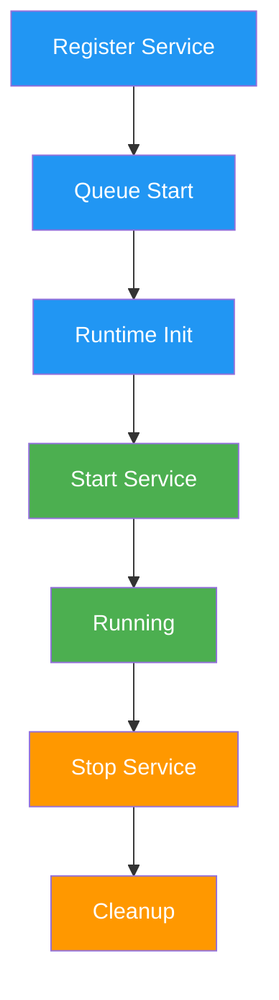

# Services

> Background services, integrations, and long-running processes

## Service System

Services are long-running background tasks that extend agent functionality beyond request-response patterns. They manage connections, handle events, and perform ongoing operations.

## Service Interface

### Abstract Service Class

```typescript theme={null}
abstract class Service {
  static serviceType: ServiceType;

  constructor(runtime?: IAgentRuntime) {}

  abstract capabilityDescription: string;
  config?: ServiceConfig;

  static async start(runtime: IAgentRuntime): Promise<Service> {
    // Return new instance of service
  }

  abstract stop(): Promise<void>;
}
```

### Service Properties

- **serviceType**: Unique identifier for the service type
- **capabilityDescription**: Human-readable description of service capabilities
- **config**: Optional configuration object
- **start**: Static method to initialize and start the service
- **stop**: Instance method to gracefully shut down the service

## Service Types

### Core Service Types

The core package defines base service types:

```typescript theme={null}
const ServiceType = {
  // Core services defined in @elizaos/core
  TASK: "task",
  DATABASE: "database",
  // ... other core types
} as const;
```

### Plugin Service Types

Plugins extend service types through module augmentation:

```typescript theme={null}
// Plugin extends ServiceType through module augmentation
declare module "@elizaos/core" {
  interface ServiceTypeRegistry {
    DISCORD: "discord";
    TELEGRAM: "telegram";
    TWITTER: "twitter";
    SEARCH: "search";
    IMAGE_GENERATION: "image_generation";
    TRANSCRIPTION: "transcription";
    // ... other plugin-specific types
  }
}
```

## Service Lifecycle



### Lifecycle Phases

1. **Registration**: Service registered with runtime during plugin initialization
2. **Queuing**: Service queued for startup
3. **Initialization**: Runtime prepares service environment
4. **Start**: Service `start()` method called
5. **Running**: Service actively processing
6. **Stop**: Graceful shutdown initiated
7. **Cleanup**: Resources released

## Common Service Patterns

### Platform Integration Service

Services that connect to external platforms:

```typescript theme={null}
class DiscordService extends Service {
  static serviceType = "discord" as const;
  capabilityDescription = "Discord bot integration";

  private client: Discord.Client;

  constructor(private runtime: IAgentRuntime) {
    super(runtime);
  }

  static async start(runtime: IAgentRuntime): Promise<Service> {
    const service = new DiscordService(runtime);
    await service.initialize();
    return service;
  }

  private async initialize() {
    // Parse environment configuration
    const token = this.runtime.getSetting("DISCORD_API_TOKEN");
    if (!token) {
      this.runtime.logger.warn("Discord token not found");
      return;
    }

    // Initialize Discord client
    this.client = new Discord.Client({
      intents: [
        /* Discord intents */
      ],
      partials: [
        /* Discord partials */
      ],
    });

    // Set up event handlers
    this.setupEventHandlers();

    // Connect to Discord
    await this.client.login(token);
  }

  private setupEventHandlers() {
    this.client.on("messageCreate", async (message) => {
      // Convert Discord message to Memory format
      const memory = await this.convertToMemory(message);

      // Process through runtime
      await this.runtime.processActions(memory, []);
    });
  }

  async stop() {
    await this.client?.destroy();
  }
}
```

### Background Task Service

Services that perform periodic or scheduled tasks:

```typescript theme={null}
class TaskService extends Service {
  static serviceType = ServiceType.TASK;
  capabilityDescription = "Scheduled task execution";

  private interval: NodeJS.Timer;
  private readonly TICK_INTERVAL = 60000; // 1 minute

  static async start(runtime: IAgentRuntime): Promise<Service> {
    const service = new TaskService(runtime);
    await service.startTimer();
    return service;
  }

  private async startTimer() {
    this.interval = setInterval(async () => {
      await this.checkTasks();
    }, this.TICK_INTERVAL);
  }

  private async checkTasks() {
    try {
      // Check for scheduled tasks
      const tasks = await this.runtime.databaseAdapter.getTasks({
        status: "pending",
        scheduledFor: { $lte: new Date() },
      });

      // Execute each task
      for (const task of tasks) {
        await this.executeTask(task);
      }
    } catch (error) {
      this.runtime.logger.error("Task check failed:", error);
    }
  }

  private async executeTask(task: Task) {
    try {
      // Mark task as running
      task.status = "running";
      await this.runtime.databaseAdapter.updateTask(task);

      // Execute task logic
      await this.processTask(task);

      // Mark task as complete
      task.status = "completed";
      await this.runtime.databaseAdapter.updateTask(task);
    } catch (error) {
      task.status = "failed";
      task.error = error.message;
      await this.runtime.databaseAdapter.updateTask(task);
    }
  }

  async stop() {
    if (this.interval) {
      clearInterval(this.interval);
    }
  }
}
```

### Data Service

Services that provide data access or caching:

```typescript theme={null}
class SearchService extends Service {
  static serviceType = "search" as const;
  capabilityDescription = "Web search capabilities";

  private searchClient: SearchClient;
  private cache: Map<string, CachedResult>;

  static async start(runtime: IAgentRuntime): Promise<Service> {
    const service = new SearchService(runtime);
    await service.initialize();
    return service;
  }

  private async initialize() {
    const apiKey = this.runtime.getSetting("SEARCH_API_KEY");

    this.searchClient = new SearchClient({
      apiKey,
      timeout: 5000,
    });

    this.cache = new Map();

    // Clear cache periodically
    setInterval(() => this.clearOldCache(), 3600000); // 1 hour
  }

  async search(query: string): Promise<SearchResult[]> {
    // Check cache
    const cached = this.cache.get(query);
    if (cached && !this.isExpired(cached)) {
      return cached.results;
    }

    // Perform search
    const results = await this.searchClient.search(query);

    // Cache results
    this.cache.set(query, {
      results,
      timestamp: Date.now(),
    });

    return results;
  }

  private clearOldCache() {
    const oneHourAgo = Date.now() - 3600000;
    for (const [key, value] of this.cache.entries()) {
      if (value.timestamp < oneHourAgo) {
        this.cache.delete(key);
      }
    }
  }

  async stop() {
    this.cache.clear();
    await this.searchClient?.close();
  }
}
```

### Model Provider Service

Services that provide AI model access:

```typescript theme={null}
class OpenAIService extends Service {
  static serviceType = "openai" as const;
  capabilityDescription = "OpenAI model provider";

  private client: OpenAI;

  static async start(runtime: IAgentRuntime): Promise<Service> {
    const service = new OpenAIService(runtime);
    await service.initialize();
    return service;
  }

  private async initialize() {
    const apiKey = this.runtime.getSetting("OPENAI_API_KEY");
    if (!apiKey) {
      throw new Error("OpenAI API key not configured");
    }

    this.client = new OpenAI({ apiKey });

    // Register model handlers
    this.runtime.registerModel(
      ModelType.TEXT_LARGE,
      this.handleTextGeneration.bind(this),
      "openai",
      100 // priority
    );

    this.runtime.registerModel(
      ModelType.TEXT_EMBEDDING,
      this.handleEmbedding.bind(this),
      "openai",
      100
    );
  }

  private async handleTextGeneration(params: GenerateTextParams) {
    const response = await this.client.chat.completions.create({
      model: params.model || "gpt-4",
      messages: params.messages,
      temperature: params.temperature,
      max_tokens: params.maxTokens,
    });

    return response.choices[0].message;
  }

  private async handleEmbedding(params: EmbedParams) {
    const response = await this.client.embeddings.create({
      model: "text-embedding-3-small",
      input: params.input,
    });

    return response.data[0].embedding;
  }

  async stop() {
    // Cleanup if needed
  }
}
```

## Service Registration

### Plugin Registration

Services are registered during plugin initialization:

```typescript theme={null}
export const discordPlugin: Plugin = {
  name: "discord",
  services: [DiscordService],

  init: async (config, runtime) => {
    // Services auto-registered and started
  },
};
```

### Manual Registration

Services can also be registered manually:

```typescript theme={null}
await runtime.registerService(CustomService);
```

## Service Management

### Getting Services

Access services through the runtime:

```typescript theme={null}
// Get service by type
const discord = runtime.getService("discord");

// Type-safe service access
const searchService = runtime.getService<SearchService>("search");
const results = await searchService.search("elizaOS");
```

### Service Communication

Services can interact with each other:

```typescript theme={null}
class NotificationService extends Service {
  static serviceType = "notification" as const;
  capabilityDescription = "Cross-platform notifications";

  async notify(message: string) {
    // Get Discord service
    const discord = this.runtime.getService("discord");
    if (discord) {
      await discord.sendMessage(channelId, message);
    }

    // Get Telegram service
    const telegram = this.runtime.getService("telegram");
    if (telegram) {
      await telegram.sendMessage(chatId, message);
    }

    // Get all services for broadcasting
    const services = this.runtime.getAllServices();
    for (const service of services) {
      if (service.supportsNotifications) {
        await service.notify(message);
      }
    }
  }
}
```

## Error Handling

### Graceful Initialization

Handle missing configuration gracefully:

```typescript theme={null}
constructor(runtime: IAgentRuntime) {
  super(runtime);

  const token = runtime.getSetting("SERVICE_TOKEN");
  if (!token) {
    runtime.logger.warn("Service token not configured");
    this.client = null;
    return;
  }

  // Initialize with token
  this.initializeClient(token);
}
```

### Error Recovery

Implement retry logic and error recovery:

```typescript theme={null}
private async connectWithRetry(maxRetries = 3) {
  for (let i = 0; i < maxRetries; i++) {
    try {
      await this.client.connect();
      this.runtime.logger.info('Service connected successfully');
      return;
    } catch (error) {
      this.runtime.logger.error(`Connection attempt ${i + 1} failed:`, error);

      if (i < maxRetries - 1) {
        const delay = Math.pow(2, i) * 1000; // Exponential backoff
        await new Promise(resolve => setTimeout(resolve, delay));
      } else {
        throw error;
      }
    }
  }
}
```

### Graceful Shutdown

Ensure proper cleanup on service stop:

```typescript theme={null}
async stop() {
  try {
    // Stop accepting new work
    this.accepting = false;

    // Wait for ongoing work to complete
    await this.waitForCompletion();

    // Close connections
    await this.client?.disconnect();

    // Clear timers
    if (this.interval) {
      clearInterval(this.interval);
    }

    // Clear caches
    this.cache?.clear();

    this.runtime.logger.info('Service stopped gracefully');
  } catch (error) {
    this.runtime.logger.error('Error during service shutdown:', error);
    // Force cleanup
    this.forceCleanup();
  }
}
```

## Best Practices

### Service Design

- **Single Responsibility**: Each service should have one clear purpose
- **Stateless When Possible**: Avoid maintaining state that could be lost
- **Idempotent Operations**: Operations should be safe to retry
- **Resource Management**: Clean up resources properly
- **Error Isolation**: Errors shouldn't crash other services

### Configuration

- **Environment Variables**: Use for sensitive configuration
- **Graceful Defaults**: Provide sensible defaults
- **Validation**: Validate configuration on startup
- **Hot Reload**: Support configuration updates without restart

### Performance

- **Async Operations**: Use async/await for non-blocking operations
- **Connection Pooling**: Reuse connections when possible
- **Caching**: Cache frequently accessed data
- **Rate Limiting**: Respect external API limits
- **Monitoring**: Log performance metrics

### Reliability

- **Health Checks**: Implement health check endpoints
- **Circuit Breakers**: Prevent cascade failures
- **Retry Logic**: Handle transient failures
- **Graceful Degradation**: Continue with reduced functionality
- **Audit Logging**: Log important operations

## Common Services

| Service             | Purpose                   | Example Plugin                       |
| ------------------- | ------------------------- | ------------------------------------ |
| Platform Services   | Connect to chat platforms | Discord, Telegram, Twitter           |
| Model Services      | AI model providers        | OpenAI, Anthropic, Ollama            |
| Data Services       | External data sources     | Web search, SQL, APIs                |
| Media Services      | Process media             | TTS, image generation, transcription |
| Background Services | Scheduled tasks           | Task runner, cron jobs               |
| Monitoring Services | System monitoring         | Metrics, logging, alerting           |

## Model Context Protocol (MCP) Services

MCP (Model Context Protocol) allows your ElizaOS agent to use external tools and services. Think of it as giving your agent abilities like web search, file access, or API connections.

### MCP Plugin Setup

```bash theme={null}
bun add @elizaos/plugin-mcp
```

Add MCP to your character's plugins:

```typescript theme={null}
export const character: Character = {
  name: "YourAgent",
  plugins: [
    "@elizaos/plugin-sql",
    "@elizaos/plugin-bootstrap",
    "@elizaos/plugin-mcp", // Add MCP plugin
    // ... other plugins
  ],
  // ... rest of configuration
};
```

### MCP Server Types

MCP supports two types of servers:

#### 1. STDIO Servers

STDIO servers run as local processes and communicate through standard input/output.

```typescript theme={null}
export const character: Character = {
  name: "WebSearchAgent",
  plugins: ["@elizaos/plugin-mcp"],
  settings: {
    mcp: {
      servers: {
        firecrawl: {
          type: "stdio",
          command: "npx",
          args: ["-y", "firecrawl-mcp"],
          env: {
            // Optional: Add your Firecrawl API key if you have one
            FIRECRAWL_API_KEY: process.env.FIRECRAWL_API_KEY || "",
          },
        },
      },
    },
  },
  system: "You are a helpful assistant with web search capabilities.",
};
```

**Capabilities:**

- Search the web for current information
- Extract content from websites
- Perform deep research on topics
- Scrape structured data

#### 2. SSE Servers

SSE (Server-Sent Events) servers connect to remote APIs through HTTP.

```typescript theme={null}
export const character: Character = {
  name: "APIAgent",
  plugins: ["@elizaos/plugin-mcp"],
  settings: {
    mcp: {
      servers: {
        myApiServer: {
          type: "sse",
          url: "https://your-api-server.com/sse", // Replace with your SSE server URL
        },
      },
    },
  },
  system: "You are a helpful assistant with API access capabilities.",
};
```

**Capabilities:**

- Real-time data access
- API interactions
- Custom tool execution
- Dynamic resource fetching

### Complete MCP Configuration Example

```typescript theme={null}
import { type Character } from "@elizaos/core";

export const character: Character = {
  name: "Eliza",
  plugins: [
    "@elizaos/plugin-sql",
    ...(process.env.ANTHROPIC_API_KEY ? ["@elizaos/plugin-anthropic"] : []),
    ...(process.env.OPENAI_API_KEY ? ["@elizaos/plugin-openai"] : []),
    "@elizaos/plugin-bootstrap",
    "@elizaos/plugin-mcp",
  ],
  settings: {
    mcp: {
      servers: {
        // STDIO server example - runs locally
        firecrawl: {
          type: "stdio",
          command: "npx",
          args: ["-y", "firecrawl-mcp"],
          env: {},
        },
        // SSE server example - connects to remote API
        customApi: {
          type: "sse",
          url: "https://your-api.com/sse",
        },
      },
    },
  },
  system:
    "You are a helpful assistant with access to web search and API tools.",
  bio: [
    "Can search the web for information",
    "Can connect to external APIs",
    "Provides helpful responses",
  ],
};
```

### Testing MCP Integration

1. Start your agent:

```bash theme={null}
bun run start
```

2. Ask your agent to use the tools:
   - For web search: "Search for \[topic]"
   - For API tools: Use commands specific to your SSE server

### MCP Troubleshooting

- **Server not connecting**: Check that the command/URL is correct
- **Tools not available**: Ensure `@elizaos/plugin-mcp` is in your plugins array
- **Permission errors**: For STDIO servers, ensure the command can be executed
- **CORS issues**: For SSE servers, ensure proper CORS headers are configured

### MCP Service Implementation

The MCP plugin internally creates services for each configured server:

```typescript theme={null}
class MCPService extends Service {
  static serviceType = "mcp" as const;
  capabilityDescription = "Model Context Protocol tool integration";

  private servers: Map<string, MCPServer> = new Map();

  async start(runtime: IAgentRuntime) {
    const mcpConfig = runtime.getSetting("mcp");

    for (const [name, config] of Object.entries(mcpConfig.servers)) {
      if (config.type === "stdio") {
        await this.startSTDIOServer(name, config);
      } else if (config.type === "sse") {
        await this.startSSEServer(name, config);
      }
    }
  }

  private async startSTDIOServer(name: string, config: STDIOConfig) {
    const server = spawn(config.command, config.args, {
      env: { ...process.env, ...config.env },
    });

    this.servers.set(name, server);

    // Handle tool responses
    server.stdout.on("data", (data) => {
      this.handleToolResponse(name, data);
    });
  }

  private async startSSEServer(name: string, config: SSEConfig) {
    const eventSource = new EventSource(config.url);

    eventSource.onmessage = (event) => {
      this.handleToolResponse(name, event.data);
    };

    this.servers.set(name, eventSource);
  }

  async stop() {
    for (const [name, server] of this.servers) {
      if (server instanceof ChildProcess) {
        server.kill();
      } else if (server instanceof EventSource) {
        server.close();
      }
    }
  }
}
```

## Service Testing

### Unit Testing

Test services in isolation:

```typescript theme={null}
describe("SearchService", () => {
  let service: SearchService;
  let runtime: MockRuntime;

  beforeEach(async () => {
    runtime = createMockRuntime();
    service = await SearchService.start(runtime);
  });

  afterEach(async () => {
    await service.stop();
  });

  it("should cache search results", async () => {
    const results1 = await service.search("test");
    const results2 = await service.search("test");

    expect(results1).toBe(results2); // Same object reference
  });
});
```

### Integration Testing

Test service interactions:

```typescript theme={null}
it("should notify through multiple channels", async () => {
  const notificationService = runtime.getService("notification");
  const discordSpy = jest.spyOn(discordService, "sendMessage");
  const telegramSpy = jest.spyOn(telegramService, "sendMessage");

  await notificationService.notify("Test message");

  expect(discordSpy).toHaveBeenCalled();
  expect(telegramSpy).toHaveBeenCalled();
});
```

## See Also

<CardGroup cols={2}>
  <Card title="Messaging" icon="message" href="/runtime/messaging">
    Build real-time messaging services
  </Card>

  <Card title="Sessions API" icon="comments" href="/runtime/sessions-api">
    Manage stateful conversations
  </Card>

  <Card title="Events" icon="bolt" href="/runtime/events">
    Handle service lifecycle events
  </Card>

  <Card title="Models" icon="robot" href="/runtime/models">
    Build model provider services
  </Card>
</CardGroup>

---

> To find navigation and other pages in this documentation, fetch the llms.txt file at: https://docs.elizaos.ai/llms.txt
