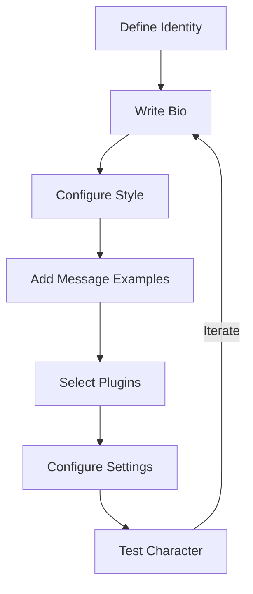
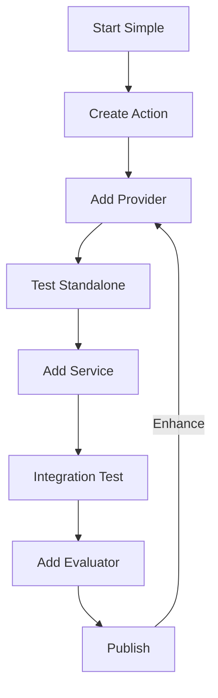

# ElizaOS Documentation Index

> **Comprehensive reference guide for ElizaOS agent development**
> Optimized for both human developers and LLM-assisted coding

## 📖 How to Use This Index

This index provides multiple navigation strategies:

- **🎯 Quick Reference**: Core concepts with direct file links
- **🗺️ Documentation Map**: Hierarchical structure of all documentation
- **📋 Task-Based Index**: Find documentation by what you want to accomplish
- **🔌 Component Reference**: Deep dive into plugin components
- **🔄 Development Workflows**: Step-by-step development patterns
- **🐛 Troubleshooting**: Common issues and solutions

---

## 🎯 Quick Reference

### Core Concepts

| Concept | Description | Documentation |
|---------|-------------|---------------|
| **Character** | Agent personality and behavior definition | [Character Interface](1-agents/1-character-interface.md) |
| **Plugin** | Modular functionality extension system | [Plugin Architecture](2-plugins/1-architecture.md) |
| **Action** | Task an agent can perform | [Components → Actions](2-plugins/2-components.md#actions) |
| **Provider** | Contextual data supplier | [Components → Providers](2-plugins/2-components.md#providers) |
| **Evaluator** | Post-processing analyzer | [Components → Evaluators](2-plugins/2-components.md#evaluators) |
| **Service** | Stateful connection manager | [Components → Services](2-plugins/2-components.md#services) |
| **Memory** | Agent storage and recall system | [Memory and State](1-agents/3-memory-and-state.md) |
| **Runtime** | Core orchestration engine | [Runtime Core](3-runtime/1-core.md) |
| **Messaging** | Real-time Socket.IO communication | [Messaging](3-runtime/7-messaging.md) |

### Essential Files

```
📂 Documentation Structure
├── 0-overview.md                          # Start here
├── llms.txt                               # LLM-optimized navigation (primary)
├── llms-full.txt                          # Complete docs (ask before use)
├── 1-agents/
│   ├── 1-character-interface.md           # Character configuration
│   ├── 2-personality-and-behavior.md      # Personality design
│   ├── 3-memory-and-state.md              # Memory architecture
│   └── 4-runtime-and-lifecycle.md         # Agent runtime lifecycle
├── 2-plugins/
│   ├── 0-create-a-plugin-guide.md         # Step-by-step plugin creation
│   ├── 1-architecture.md                  # Plugin system design
│   ├── 2-components.md                    # Actions, Providers, Evaluators, Services
│   ├── 3-development.md                   # Plugin development patterns
│   ├── 4-patterns.md                      # Common plugin patterns
│   ├── 5-webhooks-and-routes.md           # HTTP integration
│   ├── 6-database-schema.md               # Database structure
│   └── 7-reference.md                     # Plugin reference
└── 3-runtime/
    ├── 1-core.md                          # AgentRuntime class
    ├── 2-memory-and-state.md              # Runtime memory management
    ├── 3-events.md                        # Event system
    ├── 4-providers.md                     # Provider system
    ├── 5-model-management.md              # AI model configuration
    ├── 6-services.md                      # Service management
    └── 7-messaging.md                     # Socket.IO messaging (587 lines)
```

---

## 🗺️ Documentation Map

### Foundation (Start Here)
- **[Overview](0-overview.md)** - ElizaOS introduction and getting started

### Agent Development
1. **[Character Interface](1-agents/1-character-interface.md)** (530 lines)
   - Character vs Agent distinction
   - Required fields: `name`, `bio`
   - Optional configuration: `plugins`, `settings`, `messageExamples`
   - Multi-character management patterns
   - Character file structure

2. **[Personality and Behavior](1-agents/2-personality-and-behavior.md)** (1038 lines)
   - Writing effective bios
   - Style configuration (all, chat, post)
   - Message examples strategy
   - Personality archetypes
   - Behavioral consistency patterns

3. **[Memory and State](1-agents/3-memory-and-state.md)** (1001 lines)
   - Memory types: short-term, long-term, knowledge
   - Vector embeddings and semantic search
   - State composition from providers
   - Memory lifecycle and pruning
   - Context selection strategies

### Plugin Development
1. **[Create a Plugin Guide](2-plugins/0-create-a-plugin-guide.md)** (452 lines)
   - Progressive plugin development (start simple)
   - fal.ai video generation example
   - Testing strategies (standalone → integration)
   - Package structure and exports
   - Publishing plugins

2. **[Plugin Architecture](2-plugins/1-architecture.md)** (340 lines)
   - Plugin lifecycle (registration → initialization → startup)
   - Component loading order (databases → providers → features → platforms)
   - Event system integration
   - Plugin priority system (-100 to +100)
   - Cross-plugin communication

3. **[Plugin Components](2-plugins/2-components.md)** (660 lines)
   - **Actions**: What agents can DO
   - **Providers**: Context data suppliers
   - **Evaluators**: Post-response processors
   - **Services**: Stateful connection managers
   - Component interaction patterns
   - 13 core bootstrap actions

### Runtime System
1. **[Runtime Core](3-runtime/1-core.md)** (428 lines)
   - AgentRuntime class interface
   - Message processing pipeline
   - State composition mechanism
   - Plugin management
   - Database abstraction
   - Error handling patterns

2. **[Messaging](3-runtime/7-messaging.md)** (587 lines)
   - Socket.IO real-time communication
   - WebSocket architecture and event system
   - Message types and flow
   - Client implementation patterns
   - Room/channel management
   - Debugging and troubleshooting
   - Server-side message routing

---

## 📋 Task-Based Index

### "I want to..."

#### Create a New Agent
1. Start: [Character Interface](1-agents/1-character-interface.md) → Required fields
2. Design: [Personality and Behavior](1-agents/2-personality-and-behavior.md) → Bio writing
3. Configure: [Character Interface](1-agents/1-character-interface.md) → `messageExamples`, `style`
4. Test: Launch with `elizaos start --character yourcharacter.json`

#### Build a Custom Plugin
1. **Start Simple**: [Create a Plugin Guide](2-plugins/0-create-a-plugin-guide.md) → Minimal plugin
2. **Understand Architecture**: [Plugin Architecture](2-plugins/1-architecture.md) → Lifecycle
3. **Add Components**: [Plugin Components](2-plugins/2-components.md) → Actions/Providers
4. **Test**: [Create a Plugin Guide](2-plugins/0-create-a-plugin-guide.md) → Testing strategies

#### Add an Action (What Agent Can DO)
📍 **Primary Reference**: [Components → Actions](2-plugins/2-components.md#actions)

**Quick Pattern**:
```typescript
const action: Action = {
  name: "MY_ACTION",
  description: "Does something",
  validate: async () => true,
  handler: async (runtime, message) => {
    return { success: true, text: "Done!" };
  }
};
```

**Detailed Guides**:
- Action interface: [Components](2-plugins/2-components.md) → Line 22-36
- With validation: [Components](2-plugins/2-components.md) → Line 96-116
- With examples: [Components](2-plugins/2-components.md) → Line 119-142
- Core bootstrap actions: [Components](2-plugins/2-components.md) → Line 39-75

#### Add a Provider (Supply Context Data)
📍 **Primary Reference**: [Components → Providers](2-plugins/2-components.md#providers)

**Quick Pattern**:
```typescript
const provider: Provider = {
  name: "MY_DATA",
  get: async (runtime, message, state) => {
    return { text: "Context info", data: { key: "value" } };
  }
};
```

**Detailed Guides**:
- Provider interface: [Components](2-plugins/2-components.md) → Line 186-199
- Core providers: [Components](2-plugins/2-components.md) → Line 201-212
- Dynamic providers: [Components](2-plugins/2-components.md) → Line 229-239
- Priority system: [Components](2-plugins/2-components.md) → Line 254-261

#### Add Agent Memory
📍 **Primary Reference**: [Memory and State](1-agents/3-memory-and-state.md)

**Memory Operations**:
```typescript
// Store memory
await runtime.createMemory({
  type: MemoryType.MESSAGE,
  content: { text: "Important info" },
  roomId: message.roomId
});

// Search memories
const memories = await runtime.searchMemories("query", 10);
```

**Detailed Topics**:
- Memory types: [Memory and State](1-agents/3-memory-and-state.md) → Short-term, long-term, knowledge
- Vector embeddings: [Memory and State](1-agents/3-memory-and-state.md) → Semantic search
- Memory operations: [Runtime Core](3-runtime/1-core.md) → Line 270-289

#### Add an Evaluator (Process Responses)
📍 **Primary Reference**: [Components → Evaluators](2-plugins/2-components.md#evaluators)

**Quick Pattern**:
```typescript
const evaluator: Evaluator = {
  name: "my-evaluator",
  description: "Processes responses",
  validate: async () => true,
  handler: async (runtime, message) => {
    const result = await analyze(message);
    await storeResult(result);
    return result;
  }
};
```

**Use Cases**:
- Fact extraction: [Components](2-plugins/2-components.md) → Line 382-404
- Content filtering: [Components](2-plugins/2-components.md) → Line 342-347
- Analytics: [Components](2-plugins/2-components.md) → Line 349-354

#### Add a Service (Manage Connections)
📍 **Primary Reference**: [Components → Services](2-plugins/2-components.md#services)

**Service Pattern**:
```typescript
class MyService extends Service {
  static serviceType = "my-service";

  static async start(runtime: IAgentRuntime): Promise<MyService> {
    const service = new MyService(runtime);
    await service.initialize();
    return service;
  }

  async stop(): Promise<void> {
    // Cleanup resources
  }
}
```

**Detailed Guide**: [Components](2-plugins/2-components.md) → Line 446-498

#### Configure Personality
📍 **Primary Reference**: [Personality and Behavior](1-agents/2-personality-and-behavior.md)

**Key Elements**:
- **Bio**: [Personality](1-agents/2-personality-and-behavior.md) → Writing guidelines
- **Style**: [Personality](1-agents/2-personality-and-behavior.md) → `all`, `chat`, `post` patterns
- **Message Examples**: [Personality](1-agents/2-personality-and-behavior.md) → Training data strategy
- **Consistency**: [Personality](1-agents/2-personality-and-behavior.md) → Avoiding contradictions

#### Understand Message Flow
📍 **Primary Reference**: [Runtime Core](3-runtime/1-core.md)

**Pipeline Stages**:
1. Message Receipt → [Core](3-runtime/1-core.md) → Line 317
2. Memory Storage → [Core](3-runtime/1-core.md) → Line 318
3. State Composition → [Core](3-runtime/1-core.md) → Line 319
4. Action Selection → [Core](3-runtime/1-core.md) → Line 320
5. Action Execution → [Core](3-runtime/1-core.md) → Line 321
6. Evaluation → [Core](3-runtime/1-core.md) → Line 322
7. Response Generation → [Core](3-runtime/1-core.md) → Line 323

**Flow Diagram**: [Core](3-runtime/1-core.md) → Line 295-313

#### Implement Real-Time Messaging
📍 **Primary Reference**: [Messaging](3-runtime/7-messaging.md)

**Quick Socket.IO Client Pattern**:
```typescript
const socket = io("http://localhost:3000");

socket.on("connect", () => {
  // Join room first
  socket.emit("message", {
    type: 1, // ROOM_JOINING
    payload: { roomId, entityId }
  });
});

// Listen for broadcasts
socket.on("messageBroadcast", (data) => {
  if (data.roomId === roomId) {
    console.log("Message:", data.text);
  }
});
```

**Detailed Topics**:
- Socket.IO architecture: [Messaging](3-runtime/7-messaging.md) → Lines 11-53
- Message types: [Messaging](3-runtime/7-messaging.md) → Lines 64-74
- Client implementation: [Messaging](3-runtime/7-messaging.md) → Lines 85-186
- Modern implementation: [Messaging](3-runtime/7-messaging.md) → Lines 188-283
- Debugging: [Messaging](3-runtime/7-messaging.md) → Lines 337-436
- Server-side routing: [Messaging](3-runtime/7-messaging.md) → Lines 481-556

#### Test My Plugin
📍 **Primary Reference**: [Create a Plugin Guide](2-plugins/0-create-a-plugin-guide.md)

**Testing Strategies**:
1. **Standalone Testing**: Test individual actions/providers in isolation
2. **Integration Testing**: Test with full runtime environment
3. **E2E Testing**: Test complete user flows

**Testing Section**: [Create Plugin](2-plugins/0-create-a-plugin-guide.md) → Testing examples

---

## 🔌 Component Reference Matrix

### Actions (What Agents Can DO)

| Aspect | Details | Reference |
|--------|---------|-----------|
| **Interface** | `name`, `description`, `validate`, `handler` | [Components:22-36](2-plugins/2-components.md) |
| **Required Fields** | `name`, `description`, `validate`, `handler` | [Components:24-31](2-plugins/2-components.md) |
| **Handler Signature** | `(runtime, message, state?, options?, callback?) => ActionResult` | [Components:31](2-plugins/2-components.md) |
| **ActionResult** | Must include `success: boolean` field | [Components:36](2-plugins/2-components.md) |
| **Core Actions** | 13 bootstrap actions (REPLY, SEND_MESSAGE, etc.) | [Components:39-75](2-plugins/2-components.md) |
| **Examples** | Training data for action selection | [Components:119-142](2-plugins/2-components.md) |
| **Similes** | Alternative trigger phrases | [Components:28](2-plugins/2-components.md) |

**Bootstrap Actions**:
- Communication: REPLY, SEND_MESSAGE, NONE, IGNORE
- Room Management: FOLLOW_ROOM, UNFOLLOW_ROOM, MUTE_ROOM, UNMUTE_ROOM
- Data: UPDATE_CONTACT, UPDATE_ROLE, UPDATE_SETTINGS
- Media: GENERATE_IMAGE, CHOICE

### Providers (Context Suppliers)

| Aspect | Details | Reference |
|--------|---------|-----------|
| **Interface** | `name`, `description?`, `get`, `dynamic?`, `position?`, `private?` | [Components:186-199](2-plugins/2-components.md) |
| **Get Function** | `(runtime, message, state) => ProviderResult` | [Components:197](2-plugins/2-components.md) |
| **ProviderResult** | `{ text?, values?, data? }` | [Components:197](2-plugins/2-components.md) |
| **Core Providers** | character, time, knowledge, recentMessages, actions, facts, settings | [Components:201-212](2-plugins/2-components.md) |
| **Dynamic** | Re-fetch each time (not cached) | [Components:229-239](2-plugins/2-components.md) |
| **Position** | Execution priority (-100 to 100, lower = earlier) | [Components:254-261](2-plugins/2-components.md) |
| **Private** | Hidden from default provider list | [Components:242-251](2-plugins/2-components.md) |

**Execution Flow**: [Components:263-269](2-plugins/2-components.md)

### Evaluators (Post-Processors)

| Aspect | Details | Reference |
|--------|---------|-----------|
| **Interface** | `name`, `description`, `validate`, `handler`, `alwaysRun?`, `examples?` | [Components:284-298](2-plugins/2-components.md) |
| **Handler Signature** | `(runtime, message, state?) => Promise<any>` | [Components:294](2-plugins/2-components.md) |
| **Core Evaluators** | reflection, fact, goal | [Components:300-307](2-plugins/2-components.md) |
| **Use Cases** | Memory building, content filtering, analytics | [Components:333-354](2-plugins/2-components.md) |
| **AlwaysRun** | Execute on every agent response | [Components:291](2-plugins/2-components.md) |

**Flow Diagram**: [Components:310-331](2-plugins/2-components.md)

### Services (Stateful Managers)

| Aspect | Details | Reference |
|--------|---------|-----------|
| **Abstract Class** | Extends `Service` base class | [Components:419-430](2-plugins/2-components.md) |
| **Required Methods** | `static start()`, `stop()` | [Components:425-426](2-plugins/2-components.md) |
| **Service Type** | Static property identifying service | [Components:423](2-plugins/2-components.md) |
| **Lifecycle** | Singleton instances throughout agent lifecycle | [Components:417](2-plugins/2-components.md) |
| **Predefined Types** | TRANSCRIPTION, VIDEO, BROWSER, DATABASE, etc. | [Components:433-443](2-plugins/2-components.md) |

**Creation Pattern**: [Components:446-498](2-plugins/2-components.md)

---

## 🔄 Development Workflows

### Character Development Workflow



**Steps**:
1. **Identity**: [Character Interface](1-agents/1-character-interface.md) → `name`, `username`
2. **Bio**: [Personality](1-agents/2-personality-and-behavior.md) → Bio writing patterns
3. **Style**: [Personality](1-agents/2-personality-and-behavior.md) → `all`, `chat`, `post`
4. **Examples**: [Personality](1-agents/2-personality-and-behavior.md) → Message training data
5. **Plugins**: [Character Interface](1-agents/1-character-interface.md) → Plugin selection
6. **Settings**: [Character Interface](1-agents/1-character-interface.md) → Model, voice, chains
7. **Test**: Launch and iterate based on behavior

### Plugin Development Workflow



**Steps**:
1. **Start Simple**: [Create Plugin](2-plugins/0-create-a-plugin-guide.md) → Minimal action
2. **Add Components**: [Components](2-plugins/2-components.md) → Actions, Providers, Services
3. **Test**: [Create Plugin](2-plugins/0-create-a-plugin-guide.md) → Standalone → Integration
4. **Organize**: [Create Plugin](2-plugins/0-create-a-plugin-guide.md) → Structure as complexity grows
5. **Publish**: Package and distribute

### Runtime Integration Workflow

```
Plugin Registration → Component Registration → Service Startup → Ready State
```

**Detailed Lifecycle**:
1. **Create Runtime**: [Core](3-runtime/1-core.md) → Line 184
2. **Load Character**: [Core](3-runtime/1-core.md) → Line 185
3. **Load Plugins**: [Core](3-runtime/1-core.md) → Line 186
4. **Start Services**: [Core](3-runtime/1-core.md) → Line 187
5. **Ready State**: [Core](3-runtime/1-core.md) → Line 188

**Plugin Priority**: [Architecture](2-plugins/1-architecture.md) → Databases (-100) → Providers (-50) → Core (0) → Features (50) → Platforms (100)

---

## 🧩 Plugin Registry

### Required Plugins

| Plugin | Purpose | Reference |
|--------|---------|-----------|
| `@elizaos/plugin-bootstrap` | Core actions, message handling | [Components:39-75](2-plugins/2-components.md) |
| `@elizaos/plugin-sql` | Memory, database management | Required for persistence |

### Model Provider Plugins

| Plugin | Models | Use Case |
|--------|--------|----------|
| `@elizaos/plugin-openai` | GPT-4, GPT-3.5, GPT-4o | General purpose, reliable |
| `@elizaos/plugin-anthropic` | Claude 3.5 Sonnet | Reasoning, analysis |
| `@elizaos/plugin-groq` | Llama, Mixtral | Fast inference |

### Communication Plugins

| Plugin | Platform | Features |
|--------|----------|----------|
| `@elizaos/plugin-discord` | Discord | Bot integration, server management |
| `@elizaos/plugin-twitter` | Twitter/X | Posting, monitoring |
| `@elizaos/plugin-telegram` | Telegram | Bot functionality |

### Specialized Plugins

| Plugin | Domain | Capabilities |
|--------|--------|--------------|
| `@elizaos/plugin-solana` | Blockchain | Solana transactions, data |
| `@elizaos/plugin-evm` | Blockchain | Ethereum, EVM chains |
| `@elizaos/plugin-web-search` | Tools | Web search integration |
| `@elizaos/plugin-image` | Tools | Image gen, analysis |

---

## 📐 Development Patterns

### Character Configuration Patterns

**Single Character**:
```typescript
// src/character.ts
export const character: Character = {
  name: "AssistantAgent",
  bio: "...",
  plugins: [...],
  settings: {...}
};
```
📍 **Reference**: [Character Interface](1-agents/1-character-interface.md)

**Multi-Character**:
```typescript
// characters/variants.ts
export const prodCharacter: Character = {
  ...baseCharacter,
  settings: { model: "gpt-4" }
};

export const devCharacter: Character = {
  ...baseCharacter,
  settings: { model: "gpt-4o-mini" }
};
```
📍 **Reference**: [Character Interface](1-agents/1-character-interface.md) → Multi-character management

### Plugin Composition Patterns

**Minimal Plugin**:
```typescript
export const minimalPlugin: Plugin = {
  name: "minimal",
  description: "Basic functionality",
  actions: [simpleAction]
};
```

**Full-Featured Plugin**:
```typescript
export const fullPlugin: Plugin = {
  name: "complete",
  description: "All components",
  services: [MyService],
  actions: [action1, action2],
  providers: [provider1],
  evaluators: [evaluator1]
};
```
📍 **Reference**: [Components:577-631](2-plugins/2-components.md)

### State Composition Pattern

```typescript
// Providers contribute to state
const state = await runtime.composeState(message, [
  "RECENT_MESSAGES",
  "CHARACTER",
  "KNOWLEDGE"
]);

// Actions receive composed state
const result = await action.handler(runtime, message, state);
```
📍 **Reference**: [Components:552-567](2-plugins/2-components.md)

### Memory Access Pattern

```typescript
// Store memory
await runtime.createMemory({
  type: MemoryType.MESSAGE,
  content: { text: "Important" },
  roomId: message.roomId
});

// Search memories with embeddings
const memories = await runtime.searchMemories("query", 10);
```
📍 **Reference**: [Memory and State](1-agents/3-memory-and-state.md), [Core:270-289](3-runtime/1-core.md)

### Service Access Pattern

```typescript
// In actions or providers
const service = runtime.getService<MyService>("my-service");
const data = await service.getData();
```
📍 **Reference**: [Components:569-575](2-plugins/2-components.md)

---

## 🔍 API Reference Quick Links

### Character Interface
📍 **[Character Interface Documentation](1-agents/1-character-interface.md)**
```typescript
interface Character {
  name: string;                    // Required
  bio: string | string[];          // Required
  id?: UUID;
  plugins?: string[];
  settings?: object;
  messageExamples?: array[][];
  style?: {
    all?: string[];
    chat?: string[];
    post?: string[];
  };
  topics?: string[];
  adjectives?: string[];
  knowledge?: string[];
}
```

### Action Interface
📍 **[Action Interface Documentation](2-plugins/2-components.md#actions)**
```typescript
interface Action {
  name: string;
  description: string;
  similes?: string[];
  examples?: Example[][];
  validate: (runtime: IAgentRuntime, message: Memory) => Promise<boolean>;
  handler: (
    runtime: IAgentRuntime,
    message: Memory,
    state?: State,
    options?: any,
    callback?: HandlerCallback
  ) => Promise<ActionResult>;
}

interface ActionResult {
  success: boolean;  // REQUIRED
  text?: string;
  data?: any;
  error?: Error;
}
```

### Provider Interface
📍 **[Provider Interface Documentation](2-plugins/2-components.md#providers)**
```typescript
interface Provider {
  name: string;
  description?: string;
  dynamic?: boolean;
  position?: number;  // -100 to 100
  private?: boolean;
  get: (
    runtime: IAgentRuntime,
    message: Memory,
    state?: State
  ) => Promise<ProviderResult>;
}

interface ProviderResult {
  text?: string;
  values?: Record<string, any>;
  data?: any;
}
```

### Service Abstract Class
📍 **[Service Class Documentation](2-plugins/2-components.md#services)**
```typescript
abstract class Service {
  static serviceType: string;
  capabilityDescription: string;

  static start(runtime: IAgentRuntime): Promise<Service>;
  stop(): Promise<void>;
}
```

### IAgentRuntime Interface
📍 **[Runtime Interface Documentation](3-runtime/1-core.md)**
```typescript
interface IAgentRuntime extends IDatabaseAdapter {
  agentId: UUID;
  character: Character;
  providers: Provider[];
  actions: Action[];
  evaluators: Evaluator[];
  services: Service[];

  processActions(message: Memory, responses: Memory[], state?: State): Promise<void>;
  composeState(message: Memory, state?: State): Promise<State>;
  evaluate(message: Memory, state?: State): Promise<void>;

  registerAction(action: Action): void;
  registerProvider(provider: Provider): void;
  getService<T>(name: ServiceType): T;
}
```

---

## 🐛 Troubleshooting

### Common Issues & Solutions

| Issue | Symptoms | Solution | Reference |
|-------|----------|----------|-----------|
| **Plugin won't load** | "Plugin not found" errors | Check plugin name in `plugins` array | [Character Interface](1-agents/1-character-interface.md) |
| **Action not triggering** | Agent doesn't respond to commands | Check `validate` function returns true | [Components:96-116](2-plugins/2-components.md) |
| **Provider not available** | Missing context in state | Check provider registration and position | [Components:254-261](2-plugins/2-components.md) |
| **Service initialization fails** | Startup errors | Check `start()` method error handling | [Components:460-474](2-plugins/2-components.md) |
| **Memory not persisting** | Agent forgets conversations | Verify database configuration | [Memory and State](1-agents/3-memory-and-state.md) |
| **Personality inconsistent** | Agent behavior varies | Align bio, style, and examples | [Personality](1-agents/2-personality-and-behavior.md) |

### Debug Patterns

**Action Not Triggering**:
1. Check `validate` function: [Components:103-105](2-plugins/2-components.md)
2. Verify action registration: [Architecture](2-plugins/1-architecture.md)
3. Check message examples: [Components:119-142](2-plugins/2-components.md)

**Provider Data Missing**:
1. Verify provider returns data: [Components:220-227](2-plugins/2-components.md)
2. Check provider position: [Components:254-261](2-plugins/2-components.md)
3. Confirm state composition: [Core:126-140](3-runtime/1-core.md)

**Memory Issues**:
1. Check database connection: [Memory and State](1-agents/3-memory-and-state.md)
2. Verify embedding configuration: [Memory and State](1-agents/3-memory-and-state.md)
3. Review memory operations: [Core:270-289](3-runtime/1-core.md)

---

## 📚 Learning Paths

### Beginner Path
1. **Start**: [Overview](0-overview.md) - Understand ElizaOS
2. **Create Character**: [Character Interface](1-agents/1-character-interface.md)
3. **Configure Personality**: [Personality and Behavior](1-agents/2-personality-and-behavior.md)
4. **Select Plugins**: Choose from available plugins
5. **Test Agent**: Launch and iterate

### Intermediate Path
1. **Review**: [Plugin Architecture](2-plugins/1-architecture.md)
2. **Learn Components**: [Plugin Components](2-plugins/2-components.md)
3. **Build Action**: [Create Plugin Guide](2-plugins/0-create-a-plugin-guide.md)
4. **Add Provider**: Supply custom context
5. **Test Integration**: Verify plugin works with runtime

### Advanced Path
1. **Deep Dive**: [Runtime Core](3-runtime/1-core.md)
2. **Memory System**: [Memory and State](1-agents/3-memory-and-state.md)
3. **Build Service**: Manage stateful connections
4. **Create Full Plugin**: All component types
5. **Publish**: Share with community

---

## 🔗 Cross-Reference Matrix

### Character → Plugins
- Character selects plugins: [Character Interface](1-agents/1-character-interface.md)
- Plugin composition: [Plugin Architecture](2-plugins/1-architecture.md)
- Plugin priority: [Architecture](2-plugins/1-architecture.md) → Load order

### Plugins → Components
- Plugin exports components: [Components](2-plugins/2-components.md)
- Component registration: [Architecture](2-plugins/1-architecture.md)
- Component lifecycle: [Architecture](2-plugins/1-architecture.md)

### Components → Runtime
- Runtime orchestrates components: [Core](3-runtime/1-core.md)
- State composition: [Core:126-140](3-runtime/1-core.md)
- Action processing: [Core:108-123](3-runtime/1-core.md)

### Memory → State
- Memory feeds state: [Memory and State](1-agents/3-memory-and-state.md)
- State composition: [Core:126-140](3-runtime/1-core.md)
- Provider contribution: [Components:263-269](2-plugins/2-components.md)

### Personality → Behavior
- Bio defines personality: [Personality](1-agents/2-personality-and-behavior.md)
- Style guides responses: [Personality](1-agents/2-personality-and-behavior.md)
- Examples train behavior: [Personality](1-agents/2-personality-and-behavior.md)
- Character configuration: [Character Interface](1-agents/1-character-interface.md)

---

## 🎯 Decision Trees

### "Which Component Should I Use?"

```
What do you want to accomplish?
│
├─ Agent performs a task → ACTION
│  └─ Reference: [Components → Actions](2-plugins/2-components.md#actions)
│
├─ Supply contextual data → PROVIDER
│  └─ Reference: [Components → Providers](2-plugins/2-components.md#providers)
│
├─ Process agent responses → EVALUATOR
│  └─ Reference: [Components → Evaluators](2-plugins/2-components.md#evaluators)
│
└─ Manage stateful connections → SERVICE
   └─ Reference: [Components → Services](2-plugins/2-components.md#services)
```

### "How Do I Configure Personality?"

```
What aspect of personality?
│
├─ Core identity → BIO
│  └─ Reference: [Personality → Bio](1-agents/2-personality-and-behavior.md)
│
├─ Communication style → STYLE (all, chat, post)
│  └─ Reference: [Personality → Style](1-agents/2-personality-and-behavior.md)
│
├─ Training data → MESSAGE_EXAMPLES
│  └─ Reference: [Personality → Examples](1-agents/2-personality-and-behavior.md)
│
└─ Knowledge base → KNOWLEDGE, TOPICS
   └─ Reference: [Character Interface](1-agents/1-character-interface.md)
```

### "When Should I Create a Plugin?"

```
What functionality do you need?
│
├─ Available in existing plugin → USE EXISTING
│  └─ Reference: Plugin Registry (above)
│
├─ Simple configuration → CHARACTER SETTINGS
│  └─ Reference: [Character Interface](1-agents/1-character-interface.md)
│
├─ Single custom action → INLINE ACTION
│  └─ Reference: [Components → Actions](2-plugins/2-components.md#actions)
│
└─ Complex system, multiple components → CREATE PLUGIN
   └─ Reference: [Create Plugin Guide](2-plugins/0-create-a-plugin-guide.md)
```

---

## 🚀 Quick Start Cheatsheet

### Create a Character
```typescript
import { Character } from '@elizaos/core';

export const character: Character = {
  name: "MyAgent",
  bio: "Helpful assistant",
  plugins: [
    "@elizaos/plugin-bootstrap",
    "@elizaos/plugin-sql",
    "@elizaos/plugin-openai"
  ],
  settings: {
    model: "gpt-4o-mini"
  }
};
```
📍 **Reference**: [Character Interface](1-agents/1-character-interface.md)

### Create an Action
```typescript
const action: Action = {
  name: "MY_ACTION",
  description: "Does something",
  validate: async () => true,
  handler: async (runtime, message) => ({
    success: true,
    text: "Done!"
  })
};
```
📍 **Reference**: [Components → Actions](2-plugins/2-components.md#actions)

### Create a Provider
```typescript
const provider: Provider = {
  name: "MY_DATA",
  get: async (runtime, message, state) => ({
    text: "Context",
    data: { key: "value" }
  })
};
```
📍 **Reference**: [Components → Providers](2-plugins/2-components.md#providers)

### Create a Plugin
```typescript
export const myPlugin: Plugin = {
  name: "my-plugin",
  description: "Custom functionality",
  actions: [action],
  providers: [provider]
};
```
📍 **Reference**: [Create Plugin Guide](2-plugins/0-create-a-plugin-guide.md)

---

## 📖 Documentation Statistics

| Category | Files | Total Lines |
|----------|-------|-------------|
| **Agents** | 4 | 3,000+ lines |
| **Plugins** | 8 | 3,500+ lines |
| **Runtime** | 7 | 2,500+ lines |
| **Total** | 19+ | 9,000+ lines |

**Coverage**:
- ✅ Character configuration and personality design
- ✅ Plugin architecture and component system
- ✅ Memory management and state composition
- ✅ Runtime orchestration and lifecycle
- ✅ Real-time messaging and Socket.IO integration
- ✅ Development workflows and patterns
- ✅ Database schemas and webhooks
- ✅ Event systems and model management

---

## 📄 LLM Navigation Files

This documentation includes two LLM-optimized navigation files:

### llms.txt (Primary Navigation)
**File**: [llms.txt](llms.txt) - Structured index for efficient documentation navigation

**Purpose**:
- Machine-readable index of all documentation
- File paths, section markers, and topic indices
- Optimized for quick lookup and context retrieval
- Primary reference for LLM-assisted development

**Usage**:
- LLMs can reference `llms.txt` for structured navigation
- Provides high-level overview and file organization
- Fast loading and parsing for quick reference

### llms-full.txt (Complete Documentation)
**File**: [llms-full.txt](llms-full.txt) - Full documentation content in single file

**Purpose**:
- Complete concatenated documentation text
- All documentation files combined for comprehensive reference
- Deep analysis and cross-file pattern recognition

**⚠️ Important Usage Instructions**:
- **Large File Warning**: Contains 9,000+ lines of complete documentation
- **Ask Before Use**: LLMs MUST ask user for explicit confirmation before reading llms-full.txt
- **Use Cases**: Only for comprehensive analysis requiring full documentation context
- **Prefer llms.txt**: Use the structured index (llms.txt) for most navigation tasks

**When to Request llms-full.txt**:
```
LLM: "I can provide a comprehensive analysis across all documentation.
This requires reading llms-full.txt (9,000+ lines). Would you like me to proceed?"

User: "yes" → Proceed to read llms-full.txt
User: "no" → Use llms.txt and targeted file reads instead
```

---

**📌 Note**: This index is optimized for both human navigation and LLM-assisted development. All file references include line numbers where applicable for precise targeting.

**🔄 Last Updated**: Generated from ElizaOS documentation set including messaging infrastructure
